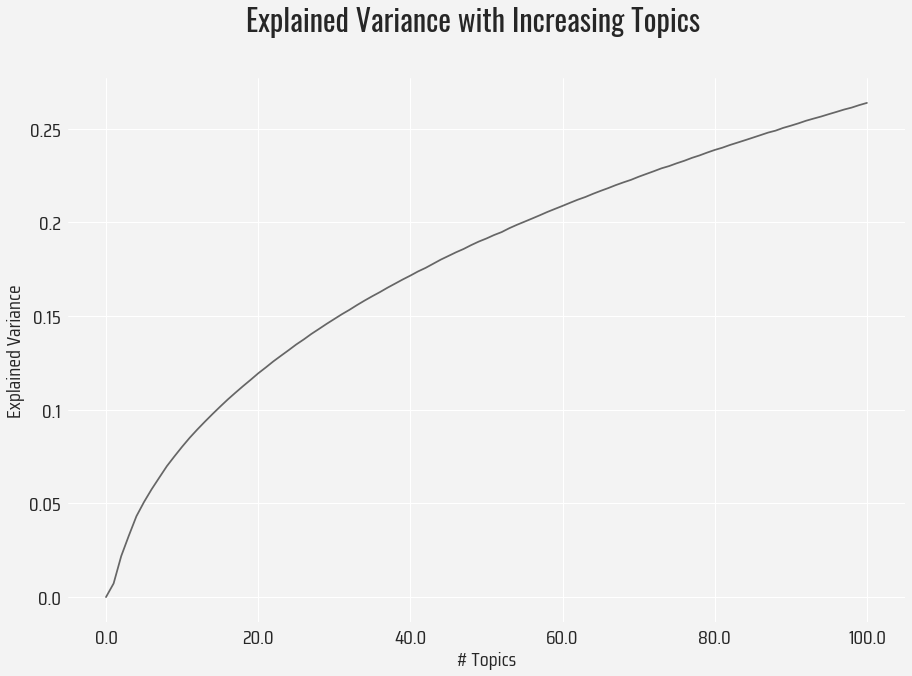
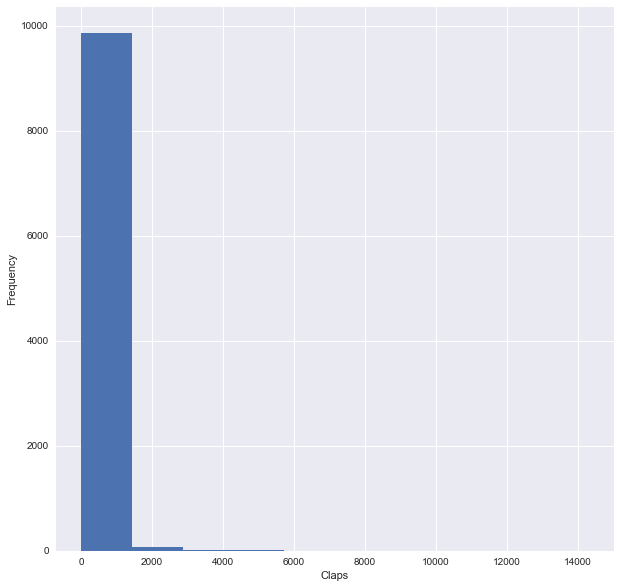
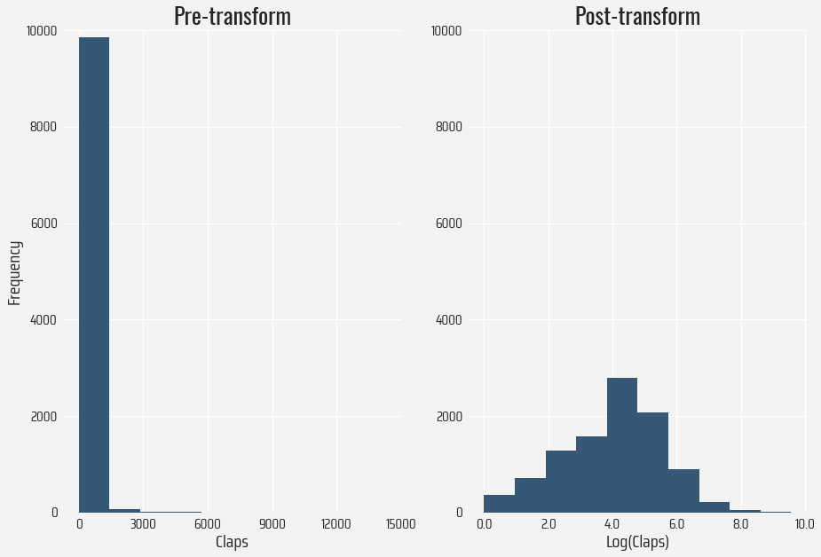
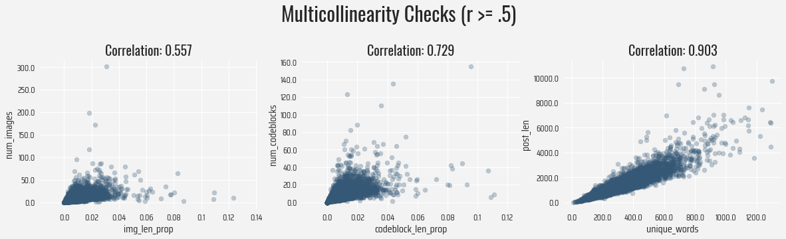
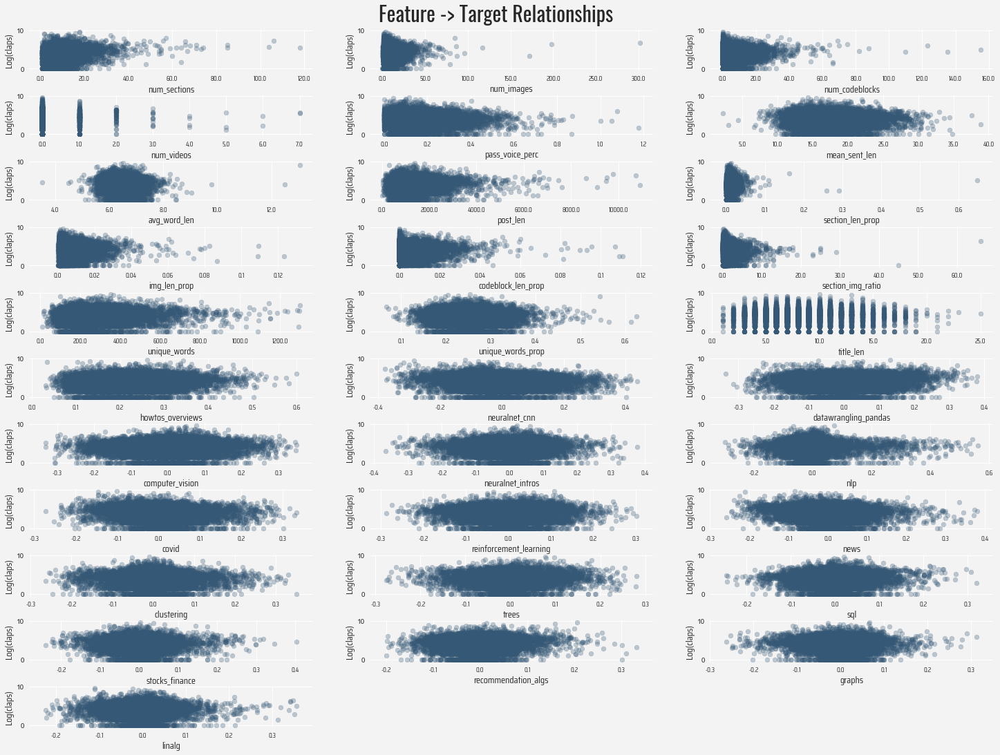
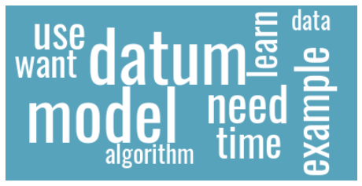

# Description

This notebook is used for processing of the raw Medium data, as well as EDA. 


```python
#Data manipulation
import pandas as pd
pd.set_option('display.max_rows', 500)
pd.set_option('display.max_columns', 500)
import numpy as np

#Text processing
import spacy
import re
from collections import Counter

#Visualization
import matplotlib.pyplot as plt
import matplotlib.font_manager as fm
import seaborn
plt.style.use('seaborn')

#Topic modeling
from sklearn.feature_extraction.text import TfidfVectorizer
from sklearn.decomposition import TruncatedSVD

#Language model
nlp = spacy.load("en_core_web_sm")
matcher = Matcher(nlp.vocab)
#Fonts for plots
header_font = fm.FontProperties(fname='../Fonts/Oswald-VariableFont_wght.ttf', size = 14)
text_font = fm.FontProperties(fname='../Fonts/SairaCondensed-Regular.ttf', size = 14)
```


```python
#Adapted from https://gist.github.com/armsp/30c2c1e19a0f1660944303cf079f831a

#Checks if any dependency tags are passive subjects
passive_rule = [{'DEP': 'nsubjpass'}]
matcher.add('Passive', None, passive_rule)

def pass_voice_det(row):
    """
    
    Returns the percentage of sentences
    containing passive voice.
    
    """
    sents = list(row.sents)
    matches = matcher(row)
    return len(matches)/len(sents)
```


```python
def mean_sent_length(row):
    """
    
    Returns the mean sentence length, and
    removes punctuation before computing
    sentence length.
    
    """
    sents = list(row.sents)
    #Remove punc
    words_punc_removed = [tok for tok in row if tok.is_punct == False]
    return len(words_punc_removed)/len(sents)
```


```python
def avg_word_length(row):
    """
    
    Removes stop-words and then calculates
    average word length in doc.
    
    """
    return np.mean([len(tok) for tok in row if tok.is_punct == False and tok.is_stop == False])
```


```python
def total_post_length(row):
    """
    
    Removes punctuation and then calculates
    total post length.
    
    """
    
    return len([tok for tok in row if tok.is_punct == False])
```


```python
def lemmatize_post(row):
    """
    
    Removes stop-words and punctuation to lemmatize 
    tokens in post.
    
    """
    return [tok.lemma_ for tok in row if tok.is_punct == False and tok.is_stop == False]
```


```python
def unique_words(row):
    """
    
    Returns unique words used in post.
    
    """
    unique = set([tok.lemma_ for tok in row if tok.is_punct == False and tok.is_stop == False])
    
    
    return len(set(unique))
```


```python
def unique_words_prop(row):
    """
    
    Returns proportion of unique words relative to overall post length.
    
    """
    
    unique = set([tok.lemma_ for tok in row if tok.is_punct == False and tok.is_stop == False])
    post_length = len([tok.lemma_ for tok in row if tok.is_punct == False])
    
    return len(set(unique))/post_length
```

# Data

First, I loaded the entirety of the scraped Medium articles (N = 9969). Some simple formatting is done to turn all claps into integers, and before the post text is analyze, I use spaCy to tokenize the posts. 


```python
sample = pd.read_csv('../Data/medium_2020_posts.pkl', compression = 'bz2')
```


```python
sample.head()
```


<div>
<style scoped>
    .dataframe tbody tr th:only-of-type {
        vertical-align: middle;
    }

    .dataframe tbody tr th {
        vertical-align: top;
    }

    .dataframe thead th {
        text-align: right;
    }
</style>
<table border="1" class="dataframe">
  <thead>
    <tr style="text-align: right;">
      <th></th>
      <th>date</th>
      <th>title</th>
      <th>post</th>
      <th>num_sections</th>
      <th>num_images</th>
      <th>num_codeblocks</th>
      <th>num_videos</th>
      <th>claps</th>
    </tr>
  </thead>
  <tbody>
    <tr>
      <th>0</th>
      <td>2020-01-01</td>
      <td>Making Python Programs Blazingly Fast</td>
      <td>Python haters always say, that one of the reas...</td>
      <td>14</td>
      <td>1</td>
      <td>9</td>
      <td>0</td>
      <td>3.3K</td>
    </tr>
    <tr>
      <th>1</th>
      <td>2020-01-01</td>
      <td>6 New Features in Python 3.8 for Python Newbies</td>
      <td>Languages change. Languages adapt. Python 2 is...</td>
      <td>13</td>
      <td>4</td>
      <td>4</td>
      <td>0</td>
      <td>1.7K</td>
    </tr>
    <tr>
      <th>2</th>
      <td>2020-01-01</td>
      <td>How to be fancy with Python</td>
      <td>Python is cool. Really cool. However, a lot of...</td>
      <td>9</td>
      <td>17</td>
      <td>0</td>
      <td>0</td>
      <td>1.6K</td>
    </tr>
    <tr>
      <th>3</th>
      <td>2020-01-01</td>
      <td>Understanding and implementing a fully convolu...</td>
      <td>Convolutional neural networks (CNN) work great...</td>
      <td>14</td>
      <td>1</td>
      <td>4</td>
      <td>0</td>
      <td>254</td>
    </tr>
    <tr>
      <th>4</th>
      <td>2020-01-01</td>
      <td>Perfectly Privacy-Preserving AI</td>
      <td>Data privacy has been called “the most importa...</td>
      <td>10</td>
      <td>3</td>
      <td>0</td>
      <td>0</td>
      <td>200</td>
    </tr>
  </tbody>
</table>
</div>


```python
sample.shape
```


    (9969, 8)


```python
#Convert claps (e.g., 3k) to ints
sample['claps'] = sample['claps'].map(lambda x: float(x.split('K')[0])*1000 if 'K' in x else x).astype('int')
```


```python
#Tokenize posts
sample['tokens'] = sample['post'].map(lambda x: nlp(x.lower()))
```

Below is where the text pre-processing occurs. Greater detail can be found in the functions' doc strings above.

1. Passive voice identifier - proportion of post containing passive voice
2. Mean sentence length
3. Mean word length
4. Total post length
5. Avg words per section
6. Avg words per image
7. Avg words per codeblock
8. Avg images per section
9. Unique words
10. Proportion of unique words to post length


```python
#1
sample['pass_voice_perc'] = sample['tokens'].map(pass_voice_det)
#2
sample['mean_sent_len'] = sample['tokens'].map(mean_sent_length)
#3
sample['avg_word_len'] = sample['tokens'].map(avg_word_length)
#4
sample['post_len'] = sample['tokens'].map(total_post_length)
#5
sample['section_len_prop'] = sample['num_sections']/sample['post_len']
#6
sample['img_len_prop'] = sample['num_images']/sample['post_len']
#7
sample['codeblock_len_prop'] = sample['num_codeblocks']/sample['post_len']
#8
sample['section_img_ratio'] = sample['num_images']/sample['num_sections']
#9
sample['unique_words'] = sample['tokens'].map(unique_words)
#10
sample['unique_words_prop'] = sample['tokens'].map(unique_words_prop)
#11
sample['title_len'] = sample['title'].map(lambda x: total_post_length(nlp(x)))
```


```python
sample.head()
```


<div>
<style scoped>
    .dataframe tbody tr th:only-of-type {
        vertical-align: middle;
    }

    .dataframe tbody tr th {
        vertical-align: top;
    }

    .dataframe thead th {
        text-align: right;
    }
</style>
<table border="1" class="dataframe">
  <thead>
    <tr style="text-align: right;">
      <th></th>
      <th>date</th>
      <th>title</th>
      <th>post</th>
      <th>num_sections</th>
      <th>num_images</th>
      <th>num_codeblocks</th>
      <th>num_videos</th>
      <th>claps</th>
      <th>tokens</th>
      <th>pass_voice_perc</th>
      <th>mean_sent_len</th>
      <th>avg_word_len</th>
      <th>post_len</th>
      <th>section_len_prop</th>
      <th>img_len_prop</th>
      <th>codeblock_len_prop</th>
      <th>section_img_ratio</th>
      <th>unique_words</th>
      <th>unique_words_prop</th>
      <th>title_len</th>
    </tr>
  </thead>
  <tbody>
    <tr>
      <th>0</th>
      <td>2020-01-01</td>
      <td>Making Python Programs Blazingly Fast</td>
      <td>Python haters always say, that one of the reas...</td>
      <td>14</td>
      <td>1</td>
      <td>9</td>
      <td>0</td>
      <td>3300</td>
      <td>(python, haters, always, say, ,, that, one, of...</td>
      <td>0.156863</td>
      <td>19.549020</td>
      <td>6.284722</td>
      <td>997</td>
      <td>0.014042</td>
      <td>0.001003</td>
      <td>0.009027</td>
      <td>0.071429</td>
      <td>255</td>
      <td>0.255767</td>
      <td>5</td>
    </tr>
    <tr>
      <th>1</th>
      <td>2020-01-01</td>
      <td>6 New Features in Python 3.8 for Python Newbies</td>
      <td>Languages change. Languages adapt. Python 2 is...</td>
      <td>13</td>
      <td>4</td>
      <td>4</td>
      <td>0</td>
      <td>1700</td>
      <td>(languages, change, ., languages, adapt, ., py...</td>
      <td>0.132075</td>
      <td>12.622642</td>
      <td>6.395137</td>
      <td>669</td>
      <td>0.019432</td>
      <td>0.005979</td>
      <td>0.005979</td>
      <td>0.307692</td>
      <td>191</td>
      <td>0.285501</td>
      <td>9</td>
    </tr>
    <tr>
      <th>2</th>
      <td>2020-01-01</td>
      <td>How to be fancy with Python</td>
      <td>Python is cool. Really cool. However, a lot of...</td>
      <td>9</td>
      <td>17</td>
      <td>0</td>
      <td>0</td>
      <td>1600</td>
      <td>(python, is, cool, ., really, cool, ., however...</td>
      <td>0.094340</td>
      <td>11.962264</td>
      <td>5.911765</td>
      <td>634</td>
      <td>0.014196</td>
      <td>0.026814</td>
      <td>0.000000</td>
      <td>1.888889</td>
      <td>151</td>
      <td>0.238170</td>
      <td>6</td>
    </tr>
    <tr>
      <th>3</th>
      <td>2020-01-01</td>
      <td>Understanding and implementing a fully convolu...</td>
      <td>Convolutional neural networks (CNN) work great...</td>
      <td>14</td>
      <td>1</td>
      <td>4</td>
      <td>0</td>
      <td>254</td>
      <td>(convolutional, neural, networks, (, cnn, ), w...</td>
      <td>0.205607</td>
      <td>18.242991</td>
      <td>6.738119</td>
      <td>1952</td>
      <td>0.007172</td>
      <td>0.000512</td>
      <td>0.002049</td>
      <td>0.071429</td>
      <td>430</td>
      <td>0.220287</td>
      <td>8</td>
    </tr>
    <tr>
      <th>4</th>
      <td>2020-01-01</td>
      <td>Perfectly Privacy-Preserving AI</td>
      <td>Data privacy has been called “the most importa...</td>
      <td>10</td>
      <td>3</td>
      <td>0</td>
      <td>0</td>
      <td>200</td>
      <td>(data, privacy, has, been, called, “, the, mos...</td>
      <td>0.154930</td>
      <td>19.676056</td>
      <td>6.646007</td>
      <td>1397</td>
      <td>0.007158</td>
      <td>0.002147</td>
      <td>0.000000</td>
      <td>0.300000</td>
      <td>465</td>
      <td>0.332856</td>
      <td>4</td>
    </tr>
  </tbody>
</table>
</div>


```python
#Checking for questionable values, NaNs, etc. 
sample.describe()
```


<div>
<style scoped>
    .dataframe tbody tr th:only-of-type {
        vertical-align: middle;
    }

    .dataframe tbody tr th {
        vertical-align: top;
    }

    .dataframe thead th {
        text-align: right;
    }
</style>
<table border="1" class="dataframe">
  <thead>
    <tr style="text-align: right;">
      <th></th>
      <th>num_sections</th>
      <th>num_images</th>
      <th>num_codeblocks</th>
      <th>num_videos</th>
      <th>claps</th>
      <th>pass_voice_perc</th>
      <th>mean_sent_len</th>
      <th>avg_word_len</th>
      <th>post_len</th>
      <th>section_len_prop</th>
      <th>img_len_prop</th>
      <th>codeblock_len_prop</th>
      <th>section_img_ratio</th>
      <th>unique_words</th>
      <th>unique_words_prop</th>
      <th>title_len</th>
    </tr>
  </thead>
  <tbody>
    <tr>
      <th>count</th>
      <td>9969.000000</td>
      <td>9969.000000</td>
      <td>9969.000000</td>
      <td>9969.000000</td>
      <td>9969.000000</td>
      <td>9969.000000</td>
      <td>9969.000000</td>
      <td>9969.000000</td>
      <td>9969.000000</td>
      <td>9969.000000</td>
      <td>9969.000000</td>
      <td>9969.000000</td>
      <td>9969.000000</td>
      <td>9969.000000</td>
      <td>9969.000000</td>
      <td>9969.000000</td>
    </tr>
    <tr>
      <th>mean</th>
      <td>9.808807</td>
      <td>8.133915</td>
      <td>4.793159</td>
      <td>0.054369</td>
      <td>160.927375</td>
      <td>0.161570</td>
      <td>17.721594</td>
      <td>6.540515</td>
      <td>1242.606681</td>
      <td>0.009657</td>
      <td>0.007438</td>
      <td>0.004918</td>
      <td>1.178662</td>
      <td>289.032400</td>
      <td>0.249973</td>
      <td>7.862674</td>
    </tr>
    <tr>
      <th>std</th>
      <td>6.915925</td>
      <td>8.659560</td>
      <td>7.667704</td>
      <td>0.304549</td>
      <td>440.025321</td>
      <td>0.110695</td>
      <td>3.575061</td>
      <td>0.415949</td>
      <td>788.967967</td>
      <td>0.010598</td>
      <td>0.007005</td>
      <td>0.007808</td>
      <td>1.776871</td>
      <td>140.654686</td>
      <td>0.051293</td>
      <td>3.008332</td>
    </tr>
    <tr>
      <th>min</th>
      <td>1.000000</td>
      <td>0.000000</td>
      <td>0.000000</td>
      <td>0.000000</td>
      <td>0.000000</td>
      <td>0.000000</td>
      <td>2.200000</td>
      <td>3.531981</td>
      <td>23.000000</td>
      <td>0.000218</td>
      <td>0.000000</td>
      <td>0.000000</td>
      <td>0.000000</td>
      <td>10.000000</td>
      <td>0.067702</td>
      <td>1.000000</td>
    </tr>
    <tr>
      <th>25%</th>
      <td>6.000000</td>
      <td>3.000000</td>
      <td>0.000000</td>
      <td>0.000000</td>
      <td>18.000000</td>
      <td>0.083333</td>
      <td>15.285714</td>
      <td>6.278183</td>
      <td>749.000000</td>
      <td>0.004922</td>
      <td>0.002967</td>
      <td>0.000000</td>
      <td>0.375000</td>
      <td>193.000000</td>
      <td>0.215686</td>
      <td>6.000000</td>
    </tr>
    <tr>
      <th>50%</th>
      <td>9.000000</td>
      <td>6.000000</td>
      <td>1.000000</td>
      <td>0.000000</td>
      <td>64.000000</td>
      <td>0.140097</td>
      <td>17.400000</td>
      <td>6.533333</td>
      <td>1066.000000</td>
      <td>0.007895</td>
      <td>0.005643</td>
      <td>0.001352</td>
      <td>0.727273</td>
      <td>262.000000</td>
      <td>0.246066</td>
      <td>8.000000</td>
    </tr>
    <tr>
      <th>75%</th>
      <td>12.000000</td>
      <td>11.000000</td>
      <td>7.000000</td>
      <td>0.000000</td>
      <td>159.000000</td>
      <td>0.212500</td>
      <td>19.833333</td>
      <td>6.788905</td>
      <td>1522.000000</td>
      <td>0.012048</td>
      <td>0.009693</td>
      <td>0.007511</td>
      <td>1.333333</td>
      <td>353.000000</td>
      <td>0.280184</td>
      <td>10.000000</td>
    </tr>
    <tr>
      <th>max</th>
      <td>118.000000</td>
      <td>302.000000</td>
      <td>155.000000</td>
      <td>7.000000</td>
      <td>14300.000000</td>
      <td>1.176471</td>
      <td>38.833333</td>
      <td>13.051020</td>
      <td>10930.000000</td>
      <td>0.647059</td>
      <td>0.123457</td>
      <td>0.111111</td>
      <td>66.000000</td>
      <td>1300.000000</td>
      <td>0.625000</td>
      <td>25.000000</td>
    </tr>
  </tbody>
</table>
</div>


## Topic Modeling

The general workflow below can be outlined as follows:

1. Gather top 20% of words in the corpus
2. Create tf-idf vectors
3. Using vectors from the top words, perform LSA to extract topics
4. Format LSA components for use as features in later regressions


```python
#Preparing text for tf-idf
corpus = (sample['tokens']
          .map(lemmatize_post)
          .map(lambda x: ' '.join([word for word in x]))
          .tolist()
         )
```


```python
#Sanity check
len(corpus) == sample.shape[0]
```


    True


```python
def top_words(corpus = list, percent = .2):
    """
    
    Returns, by default, the top 20% of word frequencies in corpus.
    Corpus input should be a list of documents, and percent should
    be a float <= 1.0.
    
    """
    word_counter = Counter()
    pattern = re.compile("[A-Za-z]+")

    for doc in corpus:
        for word in doc.split(' '):
            if pattern.fullmatch(word) and len(word) > 1:
                word_counter[word] += 1
        else:
            pass
    
    num_words = round(len(word_counter)*percent)
    
    return [word for word, count in word_counter.most_common(num_words)]
```


```python
def tfidf_df(corpus = list):
    """
    
    Returns a dataframe containing tf-idf vectors.
    
    By default, the tf-idf vectors are of the top 20%
    of words in the corpus. 
    
    """
    words = top_words(corpus)
    
    vectorizer = TfidfVectorizer()
    X = vectorizer.fit_transform(corpus)
    
    tfidf_df = pd.DataFrame(X.toarray(), columns=vectorizer.get_feature_names())
    
    word_vec_df = tfidf_df[[col for col in tfidf_df.columns if col in words]]
    
    return word_vec_df
```


```python
top_tfidf = tfidf_df(corpus)
top_tfidf.head()
```


<div>
<style scoped>
    .dataframe tbody tr th:only-of-type {
        vertical-align: middle;
    }

    .dataframe tbody tr th {
        vertical-align: top;
    }

    .dataframe thead th {
        text-align: right;
    }
</style>
<table border="1" class="dataframe">
  <thead>
    <tr style="text-align: right;">
      <th></th>
      <th>aa</th>
      <th>aaa</th>
      <th>aaai</th>
      <th>aae</th>
      <th>aapl</th>
      <th>aaron</th>
      <th>ab</th>
      <th>abae</th>
      <th>abandon</th>
      <th>abbreviate</th>
      <th>abbreviation</th>
      <th>abbyy</th>
      <th>abc</th>
      <th>abhishek</th>
      <th>abide</th>
      <th>ability</th>
      <th>ablation</th>
      <th>able</th>
      <th>abnormal</th>
      <th>abnormality</th>
      <th>abnormally</th>
      <th>aboard</th>
      <th>abound</th>
      <th>abroad</th>
      <th>abrupt</th>
      <th>abs</th>
      <th>absence</th>
      <th>absent</th>
      <th>absolute</th>
      <th>absolutely</th>
      <th>absorb</th>
      <th>absorbance</th>
      <th>abstain</th>
      <th>abstract</th>
      <th>abstraction</th>
      <th>abstractive</th>
      <th>absurd</th>
      <th>abundance</th>
      <th>abundant</th>
      <th>abuse</th>
      <th>abusive</th>
      <th>abysmal</th>
      <th>ac</th>
      <th>aca</th>
      <th>academia</th>
      <th>academic</th>
      <th>academy</th>
      <th>acc</th>
      <th>accelerate</th>
      <th>accelerated</th>
      <th>acceleration</th>
      <th>accelerator</th>
      <th>accelerometer</th>
      <th>accent</th>
      <th>accenture</th>
      <th>accept</th>
      <th>acceptable</th>
      <th>acceptance</th>
      <th>accepted</th>
      <th>access</th>
      <th>accessibility</th>
      <th>accessible</th>
      <th>accessor</th>
      <th>accessory</th>
      <th>accident</th>
      <th>accidental</th>
      <th>accidentally</th>
      <th>accommodate</th>
      <th>accommodation</th>
      <th>accompany</th>
      <th>accompanying</th>
      <th>accomplish</th>
      <th>accomplishment</th>
      <th>accord</th>
      <th>accordance</th>
      <th>accordingly</th>
      <th>account</th>
      <th>accountability</th>
      <th>accountable</th>
      <th>accountant</th>
      <th>accounting</th>
      <th>accrue</th>
      <th>accumulate</th>
      <th>accumulation</th>
      <th>accumulator</th>
      <th>accuracy</th>
      <th>accurate</th>
      <th>accurately</th>
      <th>accusation</th>
      <th>accuse</th>
      <th>accustomed</th>
      <th>ace</th>
      <th>acf</th>
      <th>achievable</th>
      <th>achieve</th>
      <th>achievement</th>
      <th>acid</th>
      <th>acidity</th>
      <th>ack</th>
      <th>acknowledge</th>
      <th>acknowledgement</th>
      <th>acknowledgment</th>
      <th>acl</th>
      <th>acm</th>
      <th>acnh</th>
      <th>acoustic</th>
      <th>acousticness</th>
      <th>acquaint</th>
      <th>acquaintance</th>
      <th>acquire</th>
      <th>acquisition</th>
      <th>acre</th>
      <th>acronym</th>
      <th>acs</th>
      <th>act</th>
      <th>action</th>
      <th>actionable</th>
      <th>activate</th>
      <th>activation</th>
      <th>active</th>
      <th>actively</th>
      <th>activist</th>
      <th>activity</th>
      <th>actor</th>
      <th>actual</th>
      <th>actually</th>
      <th>actuarial</th>
      <th>actuary</th>
      <th>actuator</th>
      <th>acute</th>
      <th>acyclic</th>
      <th>ad</th>
      <th>ada</th>
      <th>adaboost</th>
      <th>adadelta</th>
      <th>adagrad</th>
      <th>adaline</th>
      <th>adam</th>
      <th>adams</th>
      <th>adapt</th>
      <th>adaptability</th>
      <th>adaptable</th>
      <th>adaptation</th>
      <th>adapter</th>
      <th>adaptive</th>
      <th>add</th>
      <th>addict</th>
      <th>addiction</th>
      <th>addin</th>
      <th>addition</th>
      <th>additional</th>
      <th>additionally</th>
      <th>additive</th>
      <th>address</th>
      <th>adept</th>
      <th>adequate</th>
      <th>adequately</th>
      <th>adf</th>
      <th>adhere</th>
      <th>adj</th>
      <th>adjacency</th>
      <th>adjacent</th>
      <th>adjective</th>
      <th>adjoint</th>
      <th>adjunct</th>
      <th>adjust</th>
      <th>adjustable</th>
      <th>adjusted</th>
      <th>adjustment</th>
      <th>admin</th>
      <th>administer</th>
      <th>administration</th>
      <th>administrative</th>
      <th>administrator</th>
      <th>admire</th>
      <th>admission</th>
      <th>admit</th>
      <th>admittedly</th>
      <th>admond</th>
      <th>ado</th>
      <th>adobe</th>
      <th>adopt</th>
      <th>adopter</th>
      <th>adoption</th>
      <th>adp</th>
      <th>adr</th>
      <th>adrian</th>
      <th>adult</th>
      <th>advance</th>
      <th>advanced</th>
      <th>advancement</th>
      <th>advantage</th>
      <th>advantageous</th>
      <th>advent</th>
      <th>adventure</th>
      <th>adventurous</th>
      <th>adverb</th>
      <th>adversarial</th>
      <th>adversary</th>
      <th>adverse</th>
      <th>adversely</th>
      <th>advert</th>
      <th>advertise</th>
      <th>advertisement</th>
      <th>advertiser</th>
      <th>advertising</th>
      <th>advi</th>
      <th>advice</th>
      <th>advisable</th>
      <th>advise</th>
      <th>advisor</th>
      <th>advisory</th>
      <th>advocate</th>
      <th>adword</th>
      <th>aegan</th>
      <th>aei</th>
      <th>aerial</th>
      <th>aerospace</th>
      <th>aesthetic</th>
      <th>aesthetically</th>
      <th>aethos</th>
      <th>af</th>
      <th>affair</th>
      <th>affect</th>
      <th>affected</th>
      <th>affiliate</th>
      <th>affiliation</th>
      <th>affine</th>
      <th>affinity</th>
      <th>afford</th>
      <th>affordability</th>
      <th>affordable</th>
      <th>afghanistan</th>
      <th>afinn</th>
      <th>aforementione</th>
      <th>aforementioned</th>
      <th>afraid</th>
      <th>africa</th>
      <th>african</th>
      <th>afternoon</th>
      <th>afterthought</th>
      <th>afterward</th>
      <th>ag</th>
      <th>age</th>
      <th>aged</th>
      <th>agency</th>
      <th>agenda</th>
      <th>agent</th>
      <th>agg</th>
      <th>aggfunc</th>
      <th>...</th>
      <th>wet</th>
      <th>wget</th>
      <th>whale</th>
      <th>whatsapp</th>
      <th>whatsoever</th>
      <th>wheat</th>
      <th>wheel</th>
      <th>wheeler</th>
      <th>whichever</th>
      <th>whilst</th>
      <th>whip</th>
      <th>whisker</th>
      <th>whiskey</th>
      <th>whisky</th>
      <th>whistle</th>
      <th>white</th>
      <th>whiteboard</th>
      <th>whitepaper</th>
      <th>whitespace</th>
      <th>whitney</th>
      <th>wholesale</th>
      <th>wholly</th>
      <th>whopping</th>
      <th>wi</th>
      <th>wickham</th>
      <th>wide</th>
      <th>widely</th>
      <th>widen</th>
      <th>widespread</th>
      <th>widget</th>
      <th>width</th>
      <th>wife</th>
      <th>wifi</th>
      <th>wiggle</th>
      <th>wiki</th>
      <th>wikidata</th>
      <th>wikipedia</th>
      <th>wilcoxon</th>
      <th>wild</th>
      <th>wildcard</th>
      <th>wilderness</th>
      <th>wildfire</th>
      <th>wildly</th>
      <th>wiley</th>
      <th>wilk</th>
      <th>will</th>
      <th>william</th>
      <th>williams</th>
      <th>willing</th>
      <th>willingness</th>
      <th>wilson</th>
      <th>win</th>
      <th>wind</th>
      <th>window</th>
      <th>windowing</th>
      <th>windows</th>
      <th>windy</th>
      <th>wine</th>
      <th>wing</th>
      <th>winner</th>
      <th>winning</th>
      <th>winter</th>
      <th>wipe</th>
      <th>wire</th>
      <th>wired</th>
      <th>wireless</th>
      <th>wisconsin</th>
      <th>wisdom</th>
      <th>wise</th>
      <th>wisely</th>
      <th>wish</th>
      <th>withdraw</th>
      <th>withdrawal</th>
      <th>withe</th>
      <th>witness</th>
      <th>wizard</th>
      <th>wl</th>
      <th>woah</th>
      <th>woe</th>
      <th>woi</th>
      <th>wolf</th>
      <th>woman</th>
      <th>wonder</th>
      <th>wonderful</th>
      <th>wonderfully</th>
      <th>wood</th>
      <th>woolf</th>
      <th>word</th>
      <th>wordcloud</th>
      <th>wording</th>
      <th>wordnet</th>
      <th>wordpress</th>
      <th>work</th>
      <th>workable</th>
      <th>workaround</th>
      <th>workbench</th>
      <th>workbook</th>
      <th>workday</th>
      <th>worker</th>
      <th>workflow</th>
      <th>workforce</th>
      <th>workhorse</th>
      <th>working</th>
      <th>workload</th>
      <th>workout</th>
      <th>workplace</th>
      <th>works</th>
      <th>worksheet</th>
      <th>workshop</th>
      <th>workspace</th>
      <th>workstation</th>
      <th>world</th>
      <th>worldometer</th>
      <th>worldview</th>
      <th>worldwide</th>
      <th>worm</th>
      <th>worried</th>
      <th>worry</th>
      <th>worrying</th>
      <th>worse</th>
      <th>worsen</th>
      <th>worst</th>
      <th>worth</th>
      <th>worthless</th>
      <th>worthwhile</th>
      <th>worthy</th>
      <th>wow</th>
      <th>wrangle</th>
      <th>wrangler</th>
      <th>wrangling</th>
      <th>wrap</th>
      <th>wrapper</th>
      <th>wreak</th>
      <th>wrestle</th>
      <th>wright</th>
      <th>write</th>
      <th>writer</th>
      <th>writeup</th>
      <th>writing</th>
      <th>wrong</th>
      <th>wrongly</th>
      <th>wrt</th>
      <th>ws</th>
      <th>wsgi</th>
      <th>wsl</th>
      <th>wss</th>
      <th>wt</th>
      <th>wu</th>
      <th>wuhan</th>
      <th>www</th>
      <th>wx</th>
      <th>xai</th>
      <th>xavier</th>
      <th>xbox</th>
      <th>xception</th>
      <th>xcode</th>
      <th>xcom</th>
      <th>xenobot</th>
      <th>xero</th>
      <th>xg</th>
      <th>xgb</th>
      <th>xgboost</th>
      <th>xhr</th>
      <th>xi</th>
      <th>xl</th>
      <th>xla</th>
      <th>xlm</th>
      <th>xlnet</th>
      <th>xmax</th>
      <th>xmin</th>
      <th>xml</th>
      <th>xn</th>
      <th>xnnpack</th>
      <th>xor</th>
      <th>xpath</th>
      <th>xs</th>
      <th>xu</th>
      <th>xy</th>
      <th>xyz</th>
      <th>ya</th>
      <th>yahoo</th>
      <th>yale</th>
      <th>yaml</th>
      <th>yan</th>
      <th>yandex</th>
      <th>yang</th>
      <th>yann</th>
      <th>yao</th>
      <th>yard</th>
      <th>yarn</th>
      <th>yatzy</th>
      <th>yaw</th>
      <th>yay</th>
      <th>yeah</th>
      <th>year</th>
      <th>yearly</th>
      <th>yellow</th>
      <th>yellowbrick</th>
      <th>yelp</th>
      <th>yen</th>
      <th>yep</th>
      <th>yes</th>
      <th>yesterday</th>
      <th>yfinance</th>
      <th>yi</th>
      <th>yield</th>
      <th>yij</th>
      <th>ymax</th>
      <th>ymin</th>
      <th>yoga</th>
      <th>yolo</th>
      <th>york</th>
      <th>yoshua</th>
      <th>young</th>
      <th>youth</th>
      <th>youtube</th>
      <th>youtuber</th>
      <th>yr</th>
      <th>yt</th>
      <th>yu</th>
      <th>yuan</th>
      <th>yup</th>
      <th>yyyy</th>
      <th>zambia</th>
      <th>zealand</th>
      <th>zebra</th>
      <th>zee</th>
      <th>zen</th>
      <th>zeppelin</th>
      <th>zero</th>
      <th>zeta</th>
      <th>zhang</th>
      <th>zhao</th>
      <th>zheng</th>
      <th>zhou</th>
      <th>zhu</th>
      <th>zillow</th>
      <th>zine</th>
      <th>zip</th>
      <th>zipcode</th>
      <th>zisserman</th>
      <th>zombie</th>
      <th>zone</th>
      <th>zoo</th>
      <th>zookeeper</th>
      <th>zoom</th>
      <th>zooming</th>
      <th>zsh</th>
      <th>zuckerberg</th>
      <th>zynga</th>
    </tr>
  </thead>
  <tbody>
    <tr>
      <th>0</th>
      <td>0.0</td>
      <td>0.0</td>
      <td>0.0</td>
      <td>0.0</td>
      <td>0.0</td>
      <td>0.0</td>
      <td>0.000000</td>
      <td>0.0</td>
      <td>0.0</td>
      <td>0.0</td>
      <td>0.0</td>
      <td>0.0</td>
      <td>0.0</td>
      <td>0.0</td>
      <td>0.0</td>
      <td>0.026808</td>
      <td>0.0</td>
      <td>0.0</td>
      <td>0.0</td>
      <td>0.0</td>
      <td>0.0</td>
      <td>0.0</td>
      <td>0.0</td>
      <td>0.0</td>
      <td>0.0</td>
      <td>0.0</td>
      <td>0.000000</td>
      <td>0.0</td>
      <td>0.035987</td>
      <td>0.0</td>
      <td>0.0</td>
      <td>0.0</td>
      <td>0.0</td>
      <td>0.0</td>
      <td>0.0</td>
      <td>0.0</td>
      <td>0.0</td>
      <td>0.0</td>
      <td>0.0</td>
      <td>0.000000</td>
      <td>0.0</td>
      <td>0.0</td>
      <td>0.0</td>
      <td>0.0</td>
      <td>0.0</td>
      <td>0.0</td>
      <td>0.0</td>
      <td>0.0</td>
      <td>0.0</td>
      <td>0.0</td>
      <td>0.0</td>
      <td>0.0</td>
      <td>0.0</td>
      <td>0.0</td>
      <td>0.0</td>
      <td>0.000000</td>
      <td>0.0</td>
      <td>0.0</td>
      <td>0.0</td>
      <td>0.023311</td>
      <td>0.0</td>
      <td>0.0</td>
      <td>0.0</td>
      <td>0.0</td>
      <td>0.0</td>
      <td>0.0</td>
      <td>0.0</td>
      <td>0.0</td>
      <td>0.0</td>
      <td>0.0</td>
      <td>0.0</td>
      <td>0.000000</td>
      <td>0.0</td>
      <td>0.0</td>
      <td>0.0</td>
      <td>0.0</td>
      <td>0.0</td>
      <td>0.0</td>
      <td>0.0</td>
      <td>0.0</td>
      <td>0.0</td>
      <td>0.0</td>
      <td>0.0</td>
      <td>0.0</td>
      <td>0.0</td>
      <td>0.000000</td>
      <td>0.0</td>
      <td>0.0</td>
      <td>0.0</td>
      <td>0.0</td>
      <td>0.0</td>
      <td>0.0</td>
      <td>0.0</td>
      <td>0.0</td>
      <td>0.000000</td>
      <td>0.0</td>
      <td>0.0</td>
      <td>0.0</td>
      <td>0.0</td>
      <td>0.0</td>
      <td>0.0</td>
      <td>0.0</td>
      <td>0.0</td>
      <td>0.000000</td>
      <td>0.0</td>
      <td>0.0</td>
      <td>0.0</td>
      <td>0.0</td>
      <td>0.0</td>
      <td>0.0</td>
      <td>0.0</td>
      <td>0.0</td>
      <td>0.0</td>
      <td>0.0</td>
      <td>0.000000</td>
      <td>0.0</td>
      <td>0.0</td>
      <td>0.0</td>
      <td>0.000000</td>
      <td>0.0</td>
      <td>0.0</td>
      <td>0.0</td>
      <td>0.0</td>
      <td>0.0</td>
      <td>0.025353</td>
      <td>0.109526</td>
      <td>0.0</td>
      <td>0.0</td>
      <td>0.0</td>
      <td>0.0</td>
      <td>0.0</td>
      <td>0.0</td>
      <td>0.0</td>
      <td>0.0</td>
      <td>0.0</td>
      <td>0.0</td>
      <td>0.0</td>
      <td>0.000000</td>
      <td>0.0</td>
      <td>0.000000</td>
      <td>0.0</td>
      <td>0.0</td>
      <td>0.0</td>
      <td>0.0</td>
      <td>0.0</td>
      <td>0.000000</td>
      <td>0.0</td>
      <td>0.0</td>
      <td>0.0</td>
      <td>0.000000</td>
      <td>0.0</td>
      <td>0.0</td>
      <td>0.0</td>
      <td>0.000000</td>
      <td>0.0</td>
      <td>0.0</td>
      <td>0.0</td>
      <td>0.0</td>
      <td>0.0</td>
      <td>0.0</td>
      <td>0.0</td>
      <td>0.0</td>
      <td>0.0</td>
      <td>0.0</td>
      <td>0.0</td>
      <td>0.0</td>
      <td>0.0</td>
      <td>0.0</td>
      <td>0.0</td>
      <td>0.0</td>
      <td>0.0</td>
      <td>0.0</td>
      <td>0.0</td>
      <td>0.0</td>
      <td>0.0</td>
      <td>0.0</td>
      <td>0.0</td>
      <td>0.0</td>
      <td>0.0</td>
      <td>0.0</td>
      <td>0.0</td>
      <td>0.0</td>
      <td>0.0</td>
      <td>0.0</td>
      <td>0.0</td>
      <td>0.0</td>
      <td>0.0</td>
      <td>0.0</td>
      <td>0.000000</td>
      <td>0.000000</td>
      <td>0.0</td>
      <td>0.000000</td>
      <td>0.0</td>
      <td>0.0</td>
      <td>0.0</td>
      <td>0.0</td>
      <td>0.0</td>
      <td>0.0</td>
      <td>0.0</td>
      <td>0.0</td>
      <td>0.0</td>
      <td>0.0</td>
      <td>0.0</td>
      <td>0.0</td>
      <td>0.0</td>
      <td>0.0</td>
      <td>0.0</td>
      <td>0.0</td>
      <td>0.0</td>
      <td>0.0</td>
      <td>0.0</td>
      <td>0.0</td>
      <td>0.0</td>
      <td>0.0</td>
      <td>0.0</td>
      <td>0.0</td>
      <td>0.0</td>
      <td>0.0</td>
      <td>0.0</td>
      <td>0.0</td>
      <td>0.0</td>
      <td>0.0</td>
      <td>0.0</td>
      <td>0.0</td>
      <td>0.0</td>
      <td>0.0</td>
      <td>0.0</td>
      <td>0.0</td>
      <td>0.0</td>
      <td>0.0</td>
      <td>0.0</td>
      <td>0.0</td>
      <td>0.0</td>
      <td>0.0</td>
      <td>0.0</td>
      <td>0.0</td>
      <td>0.0</td>
      <td>0.0</td>
      <td>0.0</td>
      <td>0.0</td>
      <td>0.0</td>
      <td>0.0</td>
      <td>0.0</td>
      <td>0.0</td>
      <td>0.0</td>
      <td>0.0</td>
      <td>0.0</td>
      <td>0.0</td>
      <td>0.0</td>
      <td>0.0</td>
      <td>...</td>
      <td>0.0</td>
      <td>0.0</td>
      <td>0.0</td>
      <td>0.0</td>
      <td>0.0</td>
      <td>0.0</td>
      <td>0.0</td>
      <td>0.0</td>
      <td>0.0</td>
      <td>0.0</td>
      <td>0.0</td>
      <td>0.0</td>
      <td>0.0</td>
      <td>0.0</td>
      <td>0.0</td>
      <td>0.0</td>
      <td>0.0</td>
      <td>0.0</td>
      <td>0.0</td>
      <td>0.0</td>
      <td>0.0</td>
      <td>0.0</td>
      <td>0.0</td>
      <td>0.0</td>
      <td>0.0</td>
      <td>0.0</td>
      <td>0.0</td>
      <td>0.0</td>
      <td>0.0</td>
      <td>0.0</td>
      <td>0.000000</td>
      <td>0.0</td>
      <td>0.0</td>
      <td>0.0</td>
      <td>0.0</td>
      <td>0.0</td>
      <td>0.0</td>
      <td>0.0</td>
      <td>0.0</td>
      <td>0.0</td>
      <td>0.0</td>
      <td>0.0</td>
      <td>0.0</td>
      <td>0.0</td>
      <td>0.0</td>
      <td>0.0</td>
      <td>0.0</td>
      <td>0.0</td>
      <td>0.0</td>
      <td>0.0</td>
      <td>0.0</td>
      <td>0.0</td>
      <td>0.0</td>
      <td>0.0</td>
      <td>0.0</td>
      <td>0.0</td>
      <td>0.0</td>
      <td>0.0</td>
      <td>0.0</td>
      <td>0.0</td>
      <td>0.0</td>
      <td>0.0</td>
      <td>0.0</td>
      <td>0.0</td>
      <td>0.0</td>
      <td>0.0</td>
      <td>0.0</td>
      <td>0.0</td>
      <td>0.0</td>
      <td>0.0</td>
      <td>0.00000</td>
      <td>0.0</td>
      <td>0.0</td>
      <td>0.0</td>
      <td>0.0</td>
      <td>0.0</td>
      <td>0.0</td>
      <td>0.0</td>
      <td>0.0</td>
      <td>0.0</td>
      <td>0.0</td>
      <td>0.0</td>
      <td>0.0</td>
      <td>0.0</td>
      <td>0.0</td>
      <td>0.0</td>
      <td>0.0</td>
      <td>0.0</td>
      <td>0.0</td>
      <td>0.0</td>
      <td>0.0</td>
      <td>0.0</td>
      <td>0.025244</td>
      <td>0.0</td>
      <td>0.000000</td>
      <td>0.0</td>
      <td>0.0</td>
      <td>0.0</td>
      <td>0.0</td>
      <td>0.0000</td>
      <td>0.0</td>
      <td>0.0</td>
      <td>0.0</td>
      <td>0.0</td>
      <td>0.0</td>
      <td>0.0</td>
      <td>0.0</td>
      <td>0.0</td>
      <td>0.0</td>
      <td>0.0</td>
      <td>0.0</td>
      <td>0.0</td>
      <td>0.0</td>
      <td>0.0</td>
      <td>0.0</td>
      <td>0.0</td>
      <td>0.0</td>
      <td>0.0</td>
      <td>0.0</td>
      <td>0.0</td>
      <td>0.0</td>
      <td>0.0</td>
      <td>0.029401</td>
      <td>0.0</td>
      <td>0.0</td>
      <td>0.0</td>
      <td>0.0</td>
      <td>0.0</td>
      <td>0.0</td>
      <td>0.0</td>
      <td>0.038758</td>
      <td>0.0</td>
      <td>0.0</td>
      <td>0.0</td>
      <td>0.0</td>
      <td>0.053210</td>
      <td>0.0</td>
      <td>0.0</td>
      <td>0.0</td>
      <td>0.028948</td>
      <td>0.0</td>
      <td>0.0</td>
      <td>0.0</td>
      <td>0.0</td>
      <td>0.0</td>
      <td>0.0</td>
      <td>0.0</td>
      <td>0.000000</td>
      <td>0.0</td>
      <td>0.0</td>
      <td>0.0</td>
      <td>0.0</td>
      <td>0.0</td>
      <td>0.0</td>
      <td>0.0</td>
      <td>0.0</td>
      <td>0.0</td>
      <td>0.0</td>
      <td>0.0</td>
      <td>0.0</td>
      <td>0.0</td>
      <td>0.0</td>
      <td>0.0</td>
      <td>0.0</td>
      <td>0.0</td>
      <td>0.0</td>
      <td>0.0</td>
      <td>0.0</td>
      <td>0.0</td>
      <td>0.0</td>
      <td>0.0</td>
      <td>0.0</td>
      <td>0.0</td>
      <td>0.0</td>
      <td>0.0</td>
      <td>0.0</td>
      <td>0.0</td>
      <td>0.0</td>
      <td>0.0</td>
      <td>0.0</td>
      <td>0.0</td>
      <td>0.0</td>
      <td>0.0</td>
      <td>0.0</td>
      <td>0.0</td>
      <td>0.0</td>
      <td>0.0</td>
      <td>0.0</td>
      <td>0.0</td>
      <td>0.0</td>
      <td>0.0</td>
      <td>0.0</td>
      <td>0.0</td>
      <td>0.0</td>
      <td>0.00000</td>
      <td>0.0</td>
      <td>0.0</td>
      <td>0.0</td>
      <td>0.0</td>
      <td>0.0</td>
      <td>0.0</td>
      <td>0.0</td>
      <td>0.0</td>
      <td>0.0</td>
      <td>0.0</td>
      <td>0.000000</td>
      <td>0.0</td>
      <td>0.0</td>
      <td>0.0</td>
      <td>0.0</td>
      <td>0.0</td>
      <td>0.0</td>
      <td>0.0</td>
      <td>0.0</td>
      <td>0.0</td>
      <td>0.0</td>
      <td>0.0</td>
      <td>0.0</td>
      <td>0.0</td>
      <td>0.0</td>
      <td>0.0</td>
      <td>0.0</td>
      <td>0.0</td>
      <td>0.0</td>
      <td>0.0</td>
      <td>0.0</td>
      <td>0.0</td>
      <td>0.0</td>
      <td>0.0</td>
      <td>0.000000</td>
      <td>0.0</td>
      <td>0.000000</td>
      <td>0.0</td>
      <td>0.0</td>
      <td>0.0</td>
      <td>0.0</td>
      <td>0.0</td>
      <td>0.0</td>
      <td>0.000000</td>
      <td>0.0</td>
      <td>0.0</td>
      <td>0.0</td>
      <td>0.0</td>
      <td>0.0</td>
      <td>0.0</td>
      <td>0.0</td>
      <td>0.0</td>
      <td>0.0</td>
      <td>0.0</td>
      <td>0.0</td>
    </tr>
    <tr>
      <th>1</th>
      <td>0.0</td>
      <td>0.0</td>
      <td>0.0</td>
      <td>0.0</td>
      <td>0.0</td>
      <td>0.0</td>
      <td>0.063865</td>
      <td>0.0</td>
      <td>0.0</td>
      <td>0.0</td>
      <td>0.0</td>
      <td>0.0</td>
      <td>0.0</td>
      <td>0.0</td>
      <td>0.0</td>
      <td>0.000000</td>
      <td>0.0</td>
      <td>0.0</td>
      <td>0.0</td>
      <td>0.0</td>
      <td>0.0</td>
      <td>0.0</td>
      <td>0.0</td>
      <td>0.0</td>
      <td>0.0</td>
      <td>0.0</td>
      <td>0.000000</td>
      <td>0.0</td>
      <td>0.000000</td>
      <td>0.0</td>
      <td>0.0</td>
      <td>0.0</td>
      <td>0.0</td>
      <td>0.0</td>
      <td>0.0</td>
      <td>0.0</td>
      <td>0.0</td>
      <td>0.0</td>
      <td>0.0</td>
      <td>0.061445</td>
      <td>0.0</td>
      <td>0.0</td>
      <td>0.0</td>
      <td>0.0</td>
      <td>0.0</td>
      <td>0.0</td>
      <td>0.0</td>
      <td>0.0</td>
      <td>0.0</td>
      <td>0.0</td>
      <td>0.0</td>
      <td>0.0</td>
      <td>0.0</td>
      <td>0.0</td>
      <td>0.0</td>
      <td>0.075643</td>
      <td>0.0</td>
      <td>0.0</td>
      <td>0.0</td>
      <td>0.000000</td>
      <td>0.0</td>
      <td>0.0</td>
      <td>0.0</td>
      <td>0.0</td>
      <td>0.0</td>
      <td>0.0</td>
      <td>0.0</td>
      <td>0.0</td>
      <td>0.0</td>
      <td>0.0</td>
      <td>0.0</td>
      <td>0.000000</td>
      <td>0.0</td>
      <td>0.0</td>
      <td>0.0</td>
      <td>0.0</td>
      <td>0.0</td>
      <td>0.0</td>
      <td>0.0</td>
      <td>0.0</td>
      <td>0.0</td>
      <td>0.0</td>
      <td>0.0</td>
      <td>0.0</td>
      <td>0.0</td>
      <td>0.000000</td>
      <td>0.0</td>
      <td>0.0</td>
      <td>0.0</td>
      <td>0.0</td>
      <td>0.0</td>
      <td>0.0</td>
      <td>0.0</td>
      <td>0.0</td>
      <td>0.000000</td>
      <td>0.0</td>
      <td>0.0</td>
      <td>0.0</td>
      <td>0.0</td>
      <td>0.0</td>
      <td>0.0</td>
      <td>0.0</td>
      <td>0.0</td>
      <td>0.000000</td>
      <td>0.0</td>
      <td>0.0</td>
      <td>0.0</td>
      <td>0.0</td>
      <td>0.0</td>
      <td>0.0</td>
      <td>0.0</td>
      <td>0.0</td>
      <td>0.0</td>
      <td>0.0</td>
      <td>0.000000</td>
      <td>0.0</td>
      <td>0.0</td>
      <td>0.0</td>
      <td>0.000000</td>
      <td>0.0</td>
      <td>0.0</td>
      <td>0.0</td>
      <td>0.0</td>
      <td>0.0</td>
      <td>0.000000</td>
      <td>0.000000</td>
      <td>0.0</td>
      <td>0.0</td>
      <td>0.0</td>
      <td>0.0</td>
      <td>0.0</td>
      <td>0.0</td>
      <td>0.0</td>
      <td>0.0</td>
      <td>0.0</td>
      <td>0.0</td>
      <td>0.0</td>
      <td>0.000000</td>
      <td>0.0</td>
      <td>0.040267</td>
      <td>0.0</td>
      <td>0.0</td>
      <td>0.0</td>
      <td>0.0</td>
      <td>0.0</td>
      <td>0.018934</td>
      <td>0.0</td>
      <td>0.0</td>
      <td>0.0</td>
      <td>0.000000</td>
      <td>0.0</td>
      <td>0.0</td>
      <td>0.0</td>
      <td>0.000000</td>
      <td>0.0</td>
      <td>0.0</td>
      <td>0.0</td>
      <td>0.0</td>
      <td>0.0</td>
      <td>0.0</td>
      <td>0.0</td>
      <td>0.0</td>
      <td>0.0</td>
      <td>0.0</td>
      <td>0.0</td>
      <td>0.0</td>
      <td>0.0</td>
      <td>0.0</td>
      <td>0.0</td>
      <td>0.0</td>
      <td>0.0</td>
      <td>0.0</td>
      <td>0.0</td>
      <td>0.0</td>
      <td>0.0</td>
      <td>0.0</td>
      <td>0.0</td>
      <td>0.0</td>
      <td>0.0</td>
      <td>0.0</td>
      <td>0.0</td>
      <td>0.0</td>
      <td>0.0</td>
      <td>0.0</td>
      <td>0.0</td>
      <td>0.0</td>
      <td>0.0</td>
      <td>0.0</td>
      <td>0.000000</td>
      <td>0.034544</td>
      <td>0.0</td>
      <td>0.000000</td>
      <td>0.0</td>
      <td>0.0</td>
      <td>0.0</td>
      <td>0.0</td>
      <td>0.0</td>
      <td>0.0</td>
      <td>0.0</td>
      <td>0.0</td>
      <td>0.0</td>
      <td>0.0</td>
      <td>0.0</td>
      <td>0.0</td>
      <td>0.0</td>
      <td>0.0</td>
      <td>0.0</td>
      <td>0.0</td>
      <td>0.0</td>
      <td>0.0</td>
      <td>0.0</td>
      <td>0.0</td>
      <td>0.0</td>
      <td>0.0</td>
      <td>0.0</td>
      <td>0.0</td>
      <td>0.0</td>
      <td>0.0</td>
      <td>0.0</td>
      <td>0.0</td>
      <td>0.0</td>
      <td>0.0</td>
      <td>0.0</td>
      <td>0.0</td>
      <td>0.0</td>
      <td>0.0</td>
      <td>0.0</td>
      <td>0.0</td>
      <td>0.0</td>
      <td>0.0</td>
      <td>0.0</td>
      <td>0.0</td>
      <td>0.0</td>
      <td>0.0</td>
      <td>0.0</td>
      <td>0.0</td>
      <td>0.0</td>
      <td>0.0</td>
      <td>0.0</td>
      <td>0.0</td>
      <td>0.0</td>
      <td>0.0</td>
      <td>0.0</td>
      <td>0.0</td>
      <td>0.0</td>
      <td>0.0</td>
      <td>0.0</td>
      <td>0.0</td>
      <td>0.0</td>
      <td>0.0</td>
      <td>...</td>
      <td>0.0</td>
      <td>0.0</td>
      <td>0.0</td>
      <td>0.0</td>
      <td>0.0</td>
      <td>0.0</td>
      <td>0.0</td>
      <td>0.0</td>
      <td>0.0</td>
      <td>0.0</td>
      <td>0.0</td>
      <td>0.0</td>
      <td>0.0</td>
      <td>0.0</td>
      <td>0.0</td>
      <td>0.0</td>
      <td>0.0</td>
      <td>0.0</td>
      <td>0.0</td>
      <td>0.0</td>
      <td>0.0</td>
      <td>0.0</td>
      <td>0.0</td>
      <td>0.0</td>
      <td>0.0</td>
      <td>0.0</td>
      <td>0.0</td>
      <td>0.0</td>
      <td>0.0</td>
      <td>0.0</td>
      <td>0.000000</td>
      <td>0.0</td>
      <td>0.0</td>
      <td>0.0</td>
      <td>0.0</td>
      <td>0.0</td>
      <td>0.0</td>
      <td>0.0</td>
      <td>0.0</td>
      <td>0.0</td>
      <td>0.0</td>
      <td>0.0</td>
      <td>0.0</td>
      <td>0.0</td>
      <td>0.0</td>
      <td>0.0</td>
      <td>0.0</td>
      <td>0.0</td>
      <td>0.0</td>
      <td>0.0</td>
      <td>0.0</td>
      <td>0.0</td>
      <td>0.0</td>
      <td>0.0</td>
      <td>0.0</td>
      <td>0.0</td>
      <td>0.0</td>
      <td>0.0</td>
      <td>0.0</td>
      <td>0.0</td>
      <td>0.0</td>
      <td>0.0</td>
      <td>0.0</td>
      <td>0.0</td>
      <td>0.0</td>
      <td>0.0</td>
      <td>0.0</td>
      <td>0.0</td>
      <td>0.0</td>
      <td>0.0</td>
      <td>0.03868</td>
      <td>0.0</td>
      <td>0.0</td>
      <td>0.0</td>
      <td>0.0</td>
      <td>0.0</td>
      <td>0.0</td>
      <td>0.0</td>
      <td>0.0</td>
      <td>0.0</td>
      <td>0.0</td>
      <td>0.0</td>
      <td>0.0</td>
      <td>0.0</td>
      <td>0.0</td>
      <td>0.0</td>
      <td>0.0</td>
      <td>0.0</td>
      <td>0.0</td>
      <td>0.0</td>
      <td>0.0</td>
      <td>0.0</td>
      <td>0.000000</td>
      <td>0.0</td>
      <td>0.000000</td>
      <td>0.0</td>
      <td>0.0</td>
      <td>0.0</td>
      <td>0.0</td>
      <td>0.0000</td>
      <td>0.0</td>
      <td>0.0</td>
      <td>0.0</td>
      <td>0.0</td>
      <td>0.0</td>
      <td>0.0</td>
      <td>0.0</td>
      <td>0.0</td>
      <td>0.0</td>
      <td>0.0</td>
      <td>0.0</td>
      <td>0.0</td>
      <td>0.0</td>
      <td>0.0</td>
      <td>0.0</td>
      <td>0.0</td>
      <td>0.0</td>
      <td>0.0</td>
      <td>0.0</td>
      <td>0.0</td>
      <td>0.0</td>
      <td>0.0</td>
      <td>0.000000</td>
      <td>0.0</td>
      <td>0.0</td>
      <td>0.0</td>
      <td>0.0</td>
      <td>0.0</td>
      <td>0.0</td>
      <td>0.0</td>
      <td>0.000000</td>
      <td>0.0</td>
      <td>0.0</td>
      <td>0.0</td>
      <td>0.0</td>
      <td>0.019977</td>
      <td>0.0</td>
      <td>0.0</td>
      <td>0.0</td>
      <td>0.000000</td>
      <td>0.0</td>
      <td>0.0</td>
      <td>0.0</td>
      <td>0.0</td>
      <td>0.0</td>
      <td>0.0</td>
      <td>0.0</td>
      <td>0.000000</td>
      <td>0.0</td>
      <td>0.0</td>
      <td>0.0</td>
      <td>0.0</td>
      <td>0.0</td>
      <td>0.0</td>
      <td>0.0</td>
      <td>0.0</td>
      <td>0.0</td>
      <td>0.0</td>
      <td>0.0</td>
      <td>0.0</td>
      <td>0.0</td>
      <td>0.0</td>
      <td>0.0</td>
      <td>0.0</td>
      <td>0.0</td>
      <td>0.0</td>
      <td>0.0</td>
      <td>0.0</td>
      <td>0.0</td>
      <td>0.0</td>
      <td>0.0</td>
      <td>0.0</td>
      <td>0.0</td>
      <td>0.0</td>
      <td>0.0</td>
      <td>0.0</td>
      <td>0.0</td>
      <td>0.0</td>
      <td>0.0</td>
      <td>0.0</td>
      <td>0.0</td>
      <td>0.0</td>
      <td>0.0</td>
      <td>0.0</td>
      <td>0.0</td>
      <td>0.0</td>
      <td>0.0</td>
      <td>0.0</td>
      <td>0.0</td>
      <td>0.0</td>
      <td>0.0</td>
      <td>0.0</td>
      <td>0.0</td>
      <td>0.0</td>
      <td>0.00000</td>
      <td>0.0</td>
      <td>0.0</td>
      <td>0.0</td>
      <td>0.0</td>
      <td>0.0</td>
      <td>0.0</td>
      <td>0.0</td>
      <td>0.0</td>
      <td>0.0</td>
      <td>0.0</td>
      <td>0.000000</td>
      <td>0.0</td>
      <td>0.0</td>
      <td>0.0</td>
      <td>0.0</td>
      <td>0.0</td>
      <td>0.0</td>
      <td>0.0</td>
      <td>0.0</td>
      <td>0.0</td>
      <td>0.0</td>
      <td>0.0</td>
      <td>0.0</td>
      <td>0.0</td>
      <td>0.0</td>
      <td>0.0</td>
      <td>0.0</td>
      <td>0.0</td>
      <td>0.0</td>
      <td>0.0</td>
      <td>0.0</td>
      <td>0.0</td>
      <td>0.0</td>
      <td>0.0</td>
      <td>0.000000</td>
      <td>0.0</td>
      <td>0.000000</td>
      <td>0.0</td>
      <td>0.0</td>
      <td>0.0</td>
      <td>0.0</td>
      <td>0.0</td>
      <td>0.0</td>
      <td>0.000000</td>
      <td>0.0</td>
      <td>0.0</td>
      <td>0.0</td>
      <td>0.0</td>
      <td>0.0</td>
      <td>0.0</td>
      <td>0.0</td>
      <td>0.0</td>
      <td>0.0</td>
      <td>0.0</td>
      <td>0.0</td>
    </tr>
    <tr>
      <th>2</th>
      <td>0.0</td>
      <td>0.0</td>
      <td>0.0</td>
      <td>0.0</td>
      <td>0.0</td>
      <td>0.0</td>
      <td>0.000000</td>
      <td>0.0</td>
      <td>0.0</td>
      <td>0.0</td>
      <td>0.0</td>
      <td>0.0</td>
      <td>0.0</td>
      <td>0.0</td>
      <td>0.0</td>
      <td>0.000000</td>
      <td>0.0</td>
      <td>0.0</td>
      <td>0.0</td>
      <td>0.0</td>
      <td>0.0</td>
      <td>0.0</td>
      <td>0.0</td>
      <td>0.0</td>
      <td>0.0</td>
      <td>0.0</td>
      <td>0.000000</td>
      <td>0.0</td>
      <td>0.000000</td>
      <td>0.0</td>
      <td>0.0</td>
      <td>0.0</td>
      <td>0.0</td>
      <td>0.0</td>
      <td>0.0</td>
      <td>0.0</td>
      <td>0.0</td>
      <td>0.0</td>
      <td>0.0</td>
      <td>0.000000</td>
      <td>0.0</td>
      <td>0.0</td>
      <td>0.0</td>
      <td>0.0</td>
      <td>0.0</td>
      <td>0.0</td>
      <td>0.0</td>
      <td>0.0</td>
      <td>0.0</td>
      <td>0.0</td>
      <td>0.0</td>
      <td>0.0</td>
      <td>0.0</td>
      <td>0.0</td>
      <td>0.0</td>
      <td>0.000000</td>
      <td>0.0</td>
      <td>0.0</td>
      <td>0.0</td>
      <td>0.000000</td>
      <td>0.0</td>
      <td>0.0</td>
      <td>0.0</td>
      <td>0.0</td>
      <td>0.0</td>
      <td>0.0</td>
      <td>0.0</td>
      <td>0.0</td>
      <td>0.0</td>
      <td>0.0</td>
      <td>0.0</td>
      <td>0.054416</td>
      <td>0.0</td>
      <td>0.0</td>
      <td>0.0</td>
      <td>0.0</td>
      <td>0.0</td>
      <td>0.0</td>
      <td>0.0</td>
      <td>0.0</td>
      <td>0.0</td>
      <td>0.0</td>
      <td>0.0</td>
      <td>0.0</td>
      <td>0.0</td>
      <td>0.000000</td>
      <td>0.0</td>
      <td>0.0</td>
      <td>0.0</td>
      <td>0.0</td>
      <td>0.0</td>
      <td>0.0</td>
      <td>0.0</td>
      <td>0.0</td>
      <td>0.000000</td>
      <td>0.0</td>
      <td>0.0</td>
      <td>0.0</td>
      <td>0.0</td>
      <td>0.0</td>
      <td>0.0</td>
      <td>0.0</td>
      <td>0.0</td>
      <td>0.000000</td>
      <td>0.0</td>
      <td>0.0</td>
      <td>0.0</td>
      <td>0.0</td>
      <td>0.0</td>
      <td>0.0</td>
      <td>0.0</td>
      <td>0.0</td>
      <td>0.0</td>
      <td>0.0</td>
      <td>0.000000</td>
      <td>0.0</td>
      <td>0.0</td>
      <td>0.0</td>
      <td>0.000000</td>
      <td>0.0</td>
      <td>0.0</td>
      <td>0.0</td>
      <td>0.0</td>
      <td>0.0</td>
      <td>0.000000</td>
      <td>0.000000</td>
      <td>0.0</td>
      <td>0.0</td>
      <td>0.0</td>
      <td>0.0</td>
      <td>0.0</td>
      <td>0.0</td>
      <td>0.0</td>
      <td>0.0</td>
      <td>0.0</td>
      <td>0.0</td>
      <td>0.0</td>
      <td>0.000000</td>
      <td>0.0</td>
      <td>0.000000</td>
      <td>0.0</td>
      <td>0.0</td>
      <td>0.0</td>
      <td>0.0</td>
      <td>0.0</td>
      <td>0.024476</td>
      <td>0.0</td>
      <td>0.0</td>
      <td>0.0</td>
      <td>0.000000</td>
      <td>0.0</td>
      <td>0.0</td>
      <td>0.0</td>
      <td>0.000000</td>
      <td>0.0</td>
      <td>0.0</td>
      <td>0.0</td>
      <td>0.0</td>
      <td>0.0</td>
      <td>0.0</td>
      <td>0.0</td>
      <td>0.0</td>
      <td>0.0</td>
      <td>0.0</td>
      <td>0.0</td>
      <td>0.0</td>
      <td>0.0</td>
      <td>0.0</td>
      <td>0.0</td>
      <td>0.0</td>
      <td>0.0</td>
      <td>0.0</td>
      <td>0.0</td>
      <td>0.0</td>
      <td>0.0</td>
      <td>0.0</td>
      <td>0.0</td>
      <td>0.0</td>
      <td>0.0</td>
      <td>0.0</td>
      <td>0.0</td>
      <td>0.0</td>
      <td>0.0</td>
      <td>0.0</td>
      <td>0.0</td>
      <td>0.0</td>
      <td>0.0</td>
      <td>0.0</td>
      <td>0.050592</td>
      <td>0.000000</td>
      <td>0.0</td>
      <td>0.040371</td>
      <td>0.0</td>
      <td>0.0</td>
      <td>0.0</td>
      <td>0.0</td>
      <td>0.0</td>
      <td>0.0</td>
      <td>0.0</td>
      <td>0.0</td>
      <td>0.0</td>
      <td>0.0</td>
      <td>0.0</td>
      <td>0.0</td>
      <td>0.0</td>
      <td>0.0</td>
      <td>0.0</td>
      <td>0.0</td>
      <td>0.0</td>
      <td>0.0</td>
      <td>0.0</td>
      <td>0.0</td>
      <td>0.0</td>
      <td>0.0</td>
      <td>0.0</td>
      <td>0.0</td>
      <td>0.0</td>
      <td>0.0</td>
      <td>0.0</td>
      <td>0.0</td>
      <td>0.0</td>
      <td>0.0</td>
      <td>0.0</td>
      <td>0.0</td>
      <td>0.0</td>
      <td>0.0</td>
      <td>0.0</td>
      <td>0.0</td>
      <td>0.0</td>
      <td>0.0</td>
      <td>0.0</td>
      <td>0.0</td>
      <td>0.0</td>
      <td>0.0</td>
      <td>0.0</td>
      <td>0.0</td>
      <td>0.0</td>
      <td>0.0</td>
      <td>0.0</td>
      <td>0.0</td>
      <td>0.0</td>
      <td>0.0</td>
      <td>0.0</td>
      <td>0.0</td>
      <td>0.0</td>
      <td>0.0</td>
      <td>0.0</td>
      <td>0.0</td>
      <td>0.0</td>
      <td>0.0</td>
      <td>...</td>
      <td>0.0</td>
      <td>0.0</td>
      <td>0.0</td>
      <td>0.0</td>
      <td>0.0</td>
      <td>0.0</td>
      <td>0.0</td>
      <td>0.0</td>
      <td>0.0</td>
      <td>0.0</td>
      <td>0.0</td>
      <td>0.0</td>
      <td>0.0</td>
      <td>0.0</td>
      <td>0.0</td>
      <td>0.0</td>
      <td>0.0</td>
      <td>0.0</td>
      <td>0.0</td>
      <td>0.0</td>
      <td>0.0</td>
      <td>0.0</td>
      <td>0.0</td>
      <td>0.0</td>
      <td>0.0</td>
      <td>0.0</td>
      <td>0.0</td>
      <td>0.0</td>
      <td>0.0</td>
      <td>0.0</td>
      <td>0.000000</td>
      <td>0.0</td>
      <td>0.0</td>
      <td>0.0</td>
      <td>0.0</td>
      <td>0.0</td>
      <td>0.0</td>
      <td>0.0</td>
      <td>0.0</td>
      <td>0.0</td>
      <td>0.0</td>
      <td>0.0</td>
      <td>0.0</td>
      <td>0.0</td>
      <td>0.0</td>
      <td>0.0</td>
      <td>0.0</td>
      <td>0.0</td>
      <td>0.0</td>
      <td>0.0</td>
      <td>0.0</td>
      <td>0.0</td>
      <td>0.0</td>
      <td>0.0</td>
      <td>0.0</td>
      <td>0.0</td>
      <td>0.0</td>
      <td>0.0</td>
      <td>0.0</td>
      <td>0.0</td>
      <td>0.0</td>
      <td>0.0</td>
      <td>0.0</td>
      <td>0.0</td>
      <td>0.0</td>
      <td>0.0</td>
      <td>0.0</td>
      <td>0.0</td>
      <td>0.0</td>
      <td>0.0</td>
      <td>0.00000</td>
      <td>0.0</td>
      <td>0.0</td>
      <td>0.0</td>
      <td>0.0</td>
      <td>0.0</td>
      <td>0.0</td>
      <td>0.0</td>
      <td>0.0</td>
      <td>0.0</td>
      <td>0.0</td>
      <td>0.0</td>
      <td>0.0</td>
      <td>0.0</td>
      <td>0.0</td>
      <td>0.0</td>
      <td>0.0</td>
      <td>0.0</td>
      <td>0.0</td>
      <td>0.0</td>
      <td>0.0</td>
      <td>0.0</td>
      <td>0.055129</td>
      <td>0.0</td>
      <td>0.000000</td>
      <td>0.0</td>
      <td>0.0</td>
      <td>0.0</td>
      <td>0.0</td>
      <td>0.0000</td>
      <td>0.0</td>
      <td>0.0</td>
      <td>0.0</td>
      <td>0.0</td>
      <td>0.0</td>
      <td>0.0</td>
      <td>0.0</td>
      <td>0.0</td>
      <td>0.0</td>
      <td>0.0</td>
      <td>0.0</td>
      <td>0.0</td>
      <td>0.0</td>
      <td>0.0</td>
      <td>0.0</td>
      <td>0.0</td>
      <td>0.0</td>
      <td>0.0</td>
      <td>0.0</td>
      <td>0.0</td>
      <td>0.0</td>
      <td>0.0</td>
      <td>0.000000</td>
      <td>0.0</td>
      <td>0.0</td>
      <td>0.0</td>
      <td>0.0</td>
      <td>0.0</td>
      <td>0.0</td>
      <td>0.0</td>
      <td>0.000000</td>
      <td>0.0</td>
      <td>0.0</td>
      <td>0.0</td>
      <td>0.0</td>
      <td>0.129115</td>
      <td>0.0</td>
      <td>0.0</td>
      <td>0.0</td>
      <td>0.000000</td>
      <td>0.0</td>
      <td>0.0</td>
      <td>0.0</td>
      <td>0.0</td>
      <td>0.0</td>
      <td>0.0</td>
      <td>0.0</td>
      <td>0.000000</td>
      <td>0.0</td>
      <td>0.0</td>
      <td>0.0</td>
      <td>0.0</td>
      <td>0.0</td>
      <td>0.0</td>
      <td>0.0</td>
      <td>0.0</td>
      <td>0.0</td>
      <td>0.0</td>
      <td>0.0</td>
      <td>0.0</td>
      <td>0.0</td>
      <td>0.0</td>
      <td>0.0</td>
      <td>0.0</td>
      <td>0.0</td>
      <td>0.0</td>
      <td>0.0</td>
      <td>0.0</td>
      <td>0.0</td>
      <td>0.0</td>
      <td>0.0</td>
      <td>0.0</td>
      <td>0.0</td>
      <td>0.0</td>
      <td>0.0</td>
      <td>0.0</td>
      <td>0.0</td>
      <td>0.0</td>
      <td>0.0</td>
      <td>0.0</td>
      <td>0.0</td>
      <td>0.0</td>
      <td>0.0</td>
      <td>0.0</td>
      <td>0.0</td>
      <td>0.0</td>
      <td>0.0</td>
      <td>0.0</td>
      <td>0.0</td>
      <td>0.0</td>
      <td>0.0</td>
      <td>0.0</td>
      <td>0.0</td>
      <td>0.0</td>
      <td>0.02893</td>
      <td>0.0</td>
      <td>0.0</td>
      <td>0.0</td>
      <td>0.0</td>
      <td>0.0</td>
      <td>0.0</td>
      <td>0.0</td>
      <td>0.0</td>
      <td>0.0</td>
      <td>0.0</td>
      <td>0.051009</td>
      <td>0.0</td>
      <td>0.0</td>
      <td>0.0</td>
      <td>0.0</td>
      <td>0.0</td>
      <td>0.0</td>
      <td>0.0</td>
      <td>0.0</td>
      <td>0.0</td>
      <td>0.0</td>
      <td>0.0</td>
      <td>0.0</td>
      <td>0.0</td>
      <td>0.0</td>
      <td>0.0</td>
      <td>0.0</td>
      <td>0.0</td>
      <td>0.0</td>
      <td>0.0</td>
      <td>0.0</td>
      <td>0.0</td>
      <td>0.0</td>
      <td>0.0</td>
      <td>0.000000</td>
      <td>0.0</td>
      <td>0.000000</td>
      <td>0.0</td>
      <td>0.0</td>
      <td>0.0</td>
      <td>0.0</td>
      <td>0.0</td>
      <td>0.0</td>
      <td>0.065091</td>
      <td>0.0</td>
      <td>0.0</td>
      <td>0.0</td>
      <td>0.0</td>
      <td>0.0</td>
      <td>0.0</td>
      <td>0.0</td>
      <td>0.0</td>
      <td>0.0</td>
      <td>0.0</td>
      <td>0.0</td>
    </tr>
    <tr>
      <th>3</th>
      <td>0.0</td>
      <td>0.0</td>
      <td>0.0</td>
      <td>0.0</td>
      <td>0.0</td>
      <td>0.0</td>
      <td>0.000000</td>
      <td>0.0</td>
      <td>0.0</td>
      <td>0.0</td>
      <td>0.0</td>
      <td>0.0</td>
      <td>0.0</td>
      <td>0.0</td>
      <td>0.0</td>
      <td>0.011694</td>
      <td>0.0</td>
      <td>0.0</td>
      <td>0.0</td>
      <td>0.0</td>
      <td>0.0</td>
      <td>0.0</td>
      <td>0.0</td>
      <td>0.0</td>
      <td>0.0</td>
      <td>0.0</td>
      <td>0.020494</td>
      <td>0.0</td>
      <td>0.000000</td>
      <td>0.0</td>
      <td>0.0</td>
      <td>0.0</td>
      <td>0.0</td>
      <td>0.0</td>
      <td>0.0</td>
      <td>0.0</td>
      <td>0.0</td>
      <td>0.0</td>
      <td>0.0</td>
      <td>0.000000</td>
      <td>0.0</td>
      <td>0.0</td>
      <td>0.0</td>
      <td>0.0</td>
      <td>0.0</td>
      <td>0.0</td>
      <td>0.0</td>
      <td>0.0</td>
      <td>0.0</td>
      <td>0.0</td>
      <td>0.0</td>
      <td>0.0</td>
      <td>0.0</td>
      <td>0.0</td>
      <td>0.0</td>
      <td>0.000000</td>
      <td>0.0</td>
      <td>0.0</td>
      <td>0.0</td>
      <td>0.000000</td>
      <td>0.0</td>
      <td>0.0</td>
      <td>0.0</td>
      <td>0.0</td>
      <td>0.0</td>
      <td>0.0</td>
      <td>0.0</td>
      <td>0.0</td>
      <td>0.0</td>
      <td>0.0</td>
      <td>0.0</td>
      <td>0.000000</td>
      <td>0.0</td>
      <td>0.0</td>
      <td>0.0</td>
      <td>0.0</td>
      <td>0.0</td>
      <td>0.0</td>
      <td>0.0</td>
      <td>0.0</td>
      <td>0.0</td>
      <td>0.0</td>
      <td>0.0</td>
      <td>0.0</td>
      <td>0.0</td>
      <td>0.010454</td>
      <td>0.0</td>
      <td>0.0</td>
      <td>0.0</td>
      <td>0.0</td>
      <td>0.0</td>
      <td>0.0</td>
      <td>0.0</td>
      <td>0.0</td>
      <td>0.000000</td>
      <td>0.0</td>
      <td>0.0</td>
      <td>0.0</td>
      <td>0.0</td>
      <td>0.0</td>
      <td>0.0</td>
      <td>0.0</td>
      <td>0.0</td>
      <td>0.000000</td>
      <td>0.0</td>
      <td>0.0</td>
      <td>0.0</td>
      <td>0.0</td>
      <td>0.0</td>
      <td>0.0</td>
      <td>0.0</td>
      <td>0.0</td>
      <td>0.0</td>
      <td>0.0</td>
      <td>0.000000</td>
      <td>0.0</td>
      <td>0.0</td>
      <td>0.0</td>
      <td>0.031484</td>
      <td>0.0</td>
      <td>0.0</td>
      <td>0.0</td>
      <td>0.0</td>
      <td>0.0</td>
      <td>0.011059</td>
      <td>0.000000</td>
      <td>0.0</td>
      <td>0.0</td>
      <td>0.0</td>
      <td>0.0</td>
      <td>0.0</td>
      <td>0.0</td>
      <td>0.0</td>
      <td>0.0</td>
      <td>0.0</td>
      <td>0.0</td>
      <td>0.0</td>
      <td>0.018568</td>
      <td>0.0</td>
      <td>0.000000</td>
      <td>0.0</td>
      <td>0.0</td>
      <td>0.0</td>
      <td>0.0</td>
      <td>0.0</td>
      <td>0.014666</td>
      <td>0.0</td>
      <td>0.0</td>
      <td>0.0</td>
      <td>0.012165</td>
      <td>0.0</td>
      <td>0.0</td>
      <td>0.0</td>
      <td>0.000000</td>
      <td>0.0</td>
      <td>0.0</td>
      <td>0.0</td>
      <td>0.0</td>
      <td>0.0</td>
      <td>0.0</td>
      <td>0.0</td>
      <td>0.0</td>
      <td>0.0</td>
      <td>0.0</td>
      <td>0.0</td>
      <td>0.0</td>
      <td>0.0</td>
      <td>0.0</td>
      <td>0.0</td>
      <td>0.0</td>
      <td>0.0</td>
      <td>0.0</td>
      <td>0.0</td>
      <td>0.0</td>
      <td>0.0</td>
      <td>0.0</td>
      <td>0.0</td>
      <td>0.0</td>
      <td>0.0</td>
      <td>0.0</td>
      <td>0.0</td>
      <td>0.0</td>
      <td>0.0</td>
      <td>0.0</td>
      <td>0.0</td>
      <td>0.0</td>
      <td>0.0</td>
      <td>0.0</td>
      <td>0.000000</td>
      <td>0.000000</td>
      <td>0.0</td>
      <td>0.000000</td>
      <td>0.0</td>
      <td>0.0</td>
      <td>0.0</td>
      <td>0.0</td>
      <td>0.0</td>
      <td>0.0</td>
      <td>0.0</td>
      <td>0.0</td>
      <td>0.0</td>
      <td>0.0</td>
      <td>0.0</td>
      <td>0.0</td>
      <td>0.0</td>
      <td>0.0</td>
      <td>0.0</td>
      <td>0.0</td>
      <td>0.0</td>
      <td>0.0</td>
      <td>0.0</td>
      <td>0.0</td>
      <td>0.0</td>
      <td>0.0</td>
      <td>0.0</td>
      <td>0.0</td>
      <td>0.0</td>
      <td>0.0</td>
      <td>0.0</td>
      <td>0.0</td>
      <td>0.0</td>
      <td>0.0</td>
      <td>0.0</td>
      <td>0.0</td>
      <td>0.0</td>
      <td>0.0</td>
      <td>0.0</td>
      <td>0.0</td>
      <td>0.0</td>
      <td>0.0</td>
      <td>0.0</td>
      <td>0.0</td>
      <td>0.0</td>
      <td>0.0</td>
      <td>0.0</td>
      <td>0.0</td>
      <td>0.0</td>
      <td>0.0</td>
      <td>0.0</td>
      <td>0.0</td>
      <td>0.0</td>
      <td>0.0</td>
      <td>0.0</td>
      <td>0.0</td>
      <td>0.0</td>
      <td>0.0</td>
      <td>0.0</td>
      <td>0.0</td>
      <td>0.0</td>
      <td>0.0</td>
      <td>...</td>
      <td>0.0</td>
      <td>0.0</td>
      <td>0.0</td>
      <td>0.0</td>
      <td>0.0</td>
      <td>0.0</td>
      <td>0.0</td>
      <td>0.0</td>
      <td>0.0</td>
      <td>0.0</td>
      <td>0.0</td>
      <td>0.0</td>
      <td>0.0</td>
      <td>0.0</td>
      <td>0.0</td>
      <td>0.0</td>
      <td>0.0</td>
      <td>0.0</td>
      <td>0.0</td>
      <td>0.0</td>
      <td>0.0</td>
      <td>0.0</td>
      <td>0.0</td>
      <td>0.0</td>
      <td>0.0</td>
      <td>0.0</td>
      <td>0.0</td>
      <td>0.0</td>
      <td>0.0</td>
      <td>0.0</td>
      <td>0.269073</td>
      <td>0.0</td>
      <td>0.0</td>
      <td>0.0</td>
      <td>0.0</td>
      <td>0.0</td>
      <td>0.0</td>
      <td>0.0</td>
      <td>0.0</td>
      <td>0.0</td>
      <td>0.0</td>
      <td>0.0</td>
      <td>0.0</td>
      <td>0.0</td>
      <td>0.0</td>
      <td>0.0</td>
      <td>0.0</td>
      <td>0.0</td>
      <td>0.0</td>
      <td>0.0</td>
      <td>0.0</td>
      <td>0.0</td>
      <td>0.0</td>
      <td>0.0</td>
      <td>0.0</td>
      <td>0.0</td>
      <td>0.0</td>
      <td>0.0</td>
      <td>0.0</td>
      <td>0.0</td>
      <td>0.0</td>
      <td>0.0</td>
      <td>0.0</td>
      <td>0.0</td>
      <td>0.0</td>
      <td>0.0</td>
      <td>0.0</td>
      <td>0.0</td>
      <td>0.0</td>
      <td>0.0</td>
      <td>0.00000</td>
      <td>0.0</td>
      <td>0.0</td>
      <td>0.0</td>
      <td>0.0</td>
      <td>0.0</td>
      <td>0.0</td>
      <td>0.0</td>
      <td>0.0</td>
      <td>0.0</td>
      <td>0.0</td>
      <td>0.0</td>
      <td>0.0</td>
      <td>0.0</td>
      <td>0.0</td>
      <td>0.0</td>
      <td>0.0</td>
      <td>0.0</td>
      <td>0.0</td>
      <td>0.0</td>
      <td>0.0</td>
      <td>0.0</td>
      <td>0.016517</td>
      <td>0.0</td>
      <td>0.023275</td>
      <td>0.0</td>
      <td>0.0</td>
      <td>0.0</td>
      <td>0.0</td>
      <td>0.0151</td>
      <td>0.0</td>
      <td>0.0</td>
      <td>0.0</td>
      <td>0.0</td>
      <td>0.0</td>
      <td>0.0</td>
      <td>0.0</td>
      <td>0.0</td>
      <td>0.0</td>
      <td>0.0</td>
      <td>0.0</td>
      <td>0.0</td>
      <td>0.0</td>
      <td>0.0</td>
      <td>0.0</td>
      <td>0.0</td>
      <td>0.0</td>
      <td>0.0</td>
      <td>0.0</td>
      <td>0.0</td>
      <td>0.0</td>
      <td>0.0</td>
      <td>0.000000</td>
      <td>0.0</td>
      <td>0.0</td>
      <td>0.0</td>
      <td>0.0</td>
      <td>0.0</td>
      <td>0.0</td>
      <td>0.0</td>
      <td>0.000000</td>
      <td>0.0</td>
      <td>0.0</td>
      <td>0.0</td>
      <td>0.0</td>
      <td>0.007737</td>
      <td>0.0</td>
      <td>0.0</td>
      <td>0.0</td>
      <td>0.000000</td>
      <td>0.0</td>
      <td>0.0</td>
      <td>0.0</td>
      <td>0.0</td>
      <td>0.0</td>
      <td>0.0</td>
      <td>0.0</td>
      <td>0.000000</td>
      <td>0.0</td>
      <td>0.0</td>
      <td>0.0</td>
      <td>0.0</td>
      <td>0.0</td>
      <td>0.0</td>
      <td>0.0</td>
      <td>0.0</td>
      <td>0.0</td>
      <td>0.0</td>
      <td>0.0</td>
      <td>0.0</td>
      <td>0.0</td>
      <td>0.0</td>
      <td>0.0</td>
      <td>0.0</td>
      <td>0.0</td>
      <td>0.0</td>
      <td>0.0</td>
      <td>0.0</td>
      <td>0.0</td>
      <td>0.0</td>
      <td>0.0</td>
      <td>0.0</td>
      <td>0.0</td>
      <td>0.0</td>
      <td>0.0</td>
      <td>0.0</td>
      <td>0.0</td>
      <td>0.0</td>
      <td>0.0</td>
      <td>0.0</td>
      <td>0.0</td>
      <td>0.0</td>
      <td>0.0</td>
      <td>0.0</td>
      <td>0.0</td>
      <td>0.0</td>
      <td>0.0</td>
      <td>0.0</td>
      <td>0.0</td>
      <td>0.0</td>
      <td>0.0</td>
      <td>0.0</td>
      <td>0.0</td>
      <td>0.0</td>
      <td>0.00000</td>
      <td>0.0</td>
      <td>0.0</td>
      <td>0.0</td>
      <td>0.0</td>
      <td>0.0</td>
      <td>0.0</td>
      <td>0.0</td>
      <td>0.0</td>
      <td>0.0</td>
      <td>0.0</td>
      <td>0.000000</td>
      <td>0.0</td>
      <td>0.0</td>
      <td>0.0</td>
      <td>0.0</td>
      <td>0.0</td>
      <td>0.0</td>
      <td>0.0</td>
      <td>0.0</td>
      <td>0.0</td>
      <td>0.0</td>
      <td>0.0</td>
      <td>0.0</td>
      <td>0.0</td>
      <td>0.0</td>
      <td>0.0</td>
      <td>0.0</td>
      <td>0.0</td>
      <td>0.0</td>
      <td>0.0</td>
      <td>0.0</td>
      <td>0.0</td>
      <td>0.0</td>
      <td>0.0</td>
      <td>0.024682</td>
      <td>0.0</td>
      <td>0.000000</td>
      <td>0.0</td>
      <td>0.0</td>
      <td>0.0</td>
      <td>0.0</td>
      <td>0.0</td>
      <td>0.0</td>
      <td>0.000000</td>
      <td>0.0</td>
      <td>0.0</td>
      <td>0.0</td>
      <td>0.0</td>
      <td>0.0</td>
      <td>0.0</td>
      <td>0.0</td>
      <td>0.0</td>
      <td>0.0</td>
      <td>0.0</td>
      <td>0.0</td>
    </tr>
    <tr>
      <th>4</th>
      <td>0.0</td>
      <td>0.0</td>
      <td>0.0</td>
      <td>0.0</td>
      <td>0.0</td>
      <td>0.0</td>
      <td>0.000000</td>
      <td>0.0</td>
      <td>0.0</td>
      <td>0.0</td>
      <td>0.0</td>
      <td>0.0</td>
      <td>0.0</td>
      <td>0.0</td>
      <td>0.0</td>
      <td>0.000000</td>
      <td>0.0</td>
      <td>0.0</td>
      <td>0.0</td>
      <td>0.0</td>
      <td>0.0</td>
      <td>0.0</td>
      <td>0.0</td>
      <td>0.0</td>
      <td>0.0</td>
      <td>0.0</td>
      <td>0.000000</td>
      <td>0.0</td>
      <td>0.000000</td>
      <td>0.0</td>
      <td>0.0</td>
      <td>0.0</td>
      <td>0.0</td>
      <td>0.0</td>
      <td>0.0</td>
      <td>0.0</td>
      <td>0.0</td>
      <td>0.0</td>
      <td>0.0</td>
      <td>0.000000</td>
      <td>0.0</td>
      <td>0.0</td>
      <td>0.0</td>
      <td>0.0</td>
      <td>0.0</td>
      <td>0.0</td>
      <td>0.0</td>
      <td>0.0</td>
      <td>0.0</td>
      <td>0.0</td>
      <td>0.0</td>
      <td>0.0</td>
      <td>0.0</td>
      <td>0.0</td>
      <td>0.0</td>
      <td>0.000000</td>
      <td>0.0</td>
      <td>0.0</td>
      <td>0.0</td>
      <td>0.009936</td>
      <td>0.0</td>
      <td>0.0</td>
      <td>0.0</td>
      <td>0.0</td>
      <td>0.0</td>
      <td>0.0</td>
      <td>0.0</td>
      <td>0.0</td>
      <td>0.0</td>
      <td>0.0</td>
      <td>0.0</td>
      <td>0.000000</td>
      <td>0.0</td>
      <td>0.0</td>
      <td>0.0</td>
      <td>0.0</td>
      <td>0.0</td>
      <td>0.0</td>
      <td>0.0</td>
      <td>0.0</td>
      <td>0.0</td>
      <td>0.0</td>
      <td>0.0</td>
      <td>0.0</td>
      <td>0.0</td>
      <td>0.010215</td>
      <td>0.0</td>
      <td>0.0</td>
      <td>0.0</td>
      <td>0.0</td>
      <td>0.0</td>
      <td>0.0</td>
      <td>0.0</td>
      <td>0.0</td>
      <td>0.030023</td>
      <td>0.0</td>
      <td>0.0</td>
      <td>0.0</td>
      <td>0.0</td>
      <td>0.0</td>
      <td>0.0</td>
      <td>0.0</td>
      <td>0.0</td>
      <td>0.071329</td>
      <td>0.0</td>
      <td>0.0</td>
      <td>0.0</td>
      <td>0.0</td>
      <td>0.0</td>
      <td>0.0</td>
      <td>0.0</td>
      <td>0.0</td>
      <td>0.0</td>
      <td>0.0</td>
      <td>0.027478</td>
      <td>0.0</td>
      <td>0.0</td>
      <td>0.0</td>
      <td>0.000000</td>
      <td>0.0</td>
      <td>0.0</td>
      <td>0.0</td>
      <td>0.0</td>
      <td>0.0</td>
      <td>0.000000</td>
      <td>0.000000</td>
      <td>0.0</td>
      <td>0.0</td>
      <td>0.0</td>
      <td>0.0</td>
      <td>0.0</td>
      <td>0.0</td>
      <td>0.0</td>
      <td>0.0</td>
      <td>0.0</td>
      <td>0.0</td>
      <td>0.0</td>
      <td>0.000000</td>
      <td>0.0</td>
      <td>0.000000</td>
      <td>0.0</td>
      <td>0.0</td>
      <td>0.0</td>
      <td>0.0</td>
      <td>0.0</td>
      <td>0.000000</td>
      <td>0.0</td>
      <td>0.0</td>
      <td>0.0</td>
      <td>0.000000</td>
      <td>0.0</td>
      <td>0.0</td>
      <td>0.0</td>
      <td>0.024174</td>
      <td>0.0</td>
      <td>0.0</td>
      <td>0.0</td>
      <td>0.0</td>
      <td>0.0</td>
      <td>0.0</td>
      <td>0.0</td>
      <td>0.0</td>
      <td>0.0</td>
      <td>0.0</td>
      <td>0.0</td>
      <td>0.0</td>
      <td>0.0</td>
      <td>0.0</td>
      <td>0.0</td>
      <td>0.0</td>
      <td>0.0</td>
      <td>0.0</td>
      <td>0.0</td>
      <td>0.0</td>
      <td>0.0</td>
      <td>0.0</td>
      <td>0.0</td>
      <td>0.0</td>
      <td>0.0</td>
      <td>0.0</td>
      <td>0.0</td>
      <td>0.0</td>
      <td>0.0</td>
      <td>0.0</td>
      <td>0.0</td>
      <td>0.0</td>
      <td>0.0</td>
      <td>0.0</td>
      <td>0.000000</td>
      <td>0.000000</td>
      <td>0.0</td>
      <td>0.000000</td>
      <td>0.0</td>
      <td>0.0</td>
      <td>0.0</td>
      <td>0.0</td>
      <td>0.0</td>
      <td>0.0</td>
      <td>0.0</td>
      <td>0.0</td>
      <td>0.0</td>
      <td>0.0</td>
      <td>0.0</td>
      <td>0.0</td>
      <td>0.0</td>
      <td>0.0</td>
      <td>0.0</td>
      <td>0.0</td>
      <td>0.0</td>
      <td>0.0</td>
      <td>0.0</td>
      <td>0.0</td>
      <td>0.0</td>
      <td>0.0</td>
      <td>0.0</td>
      <td>0.0</td>
      <td>0.0</td>
      <td>0.0</td>
      <td>0.0</td>
      <td>0.0</td>
      <td>0.0</td>
      <td>0.0</td>
      <td>0.0</td>
      <td>0.0</td>
      <td>0.0</td>
      <td>0.0</td>
      <td>0.0</td>
      <td>0.0</td>
      <td>0.0</td>
      <td>0.0</td>
      <td>0.0</td>
      <td>0.0</td>
      <td>0.0</td>
      <td>0.0</td>
      <td>0.0</td>
      <td>0.0</td>
      <td>0.0</td>
      <td>0.0</td>
      <td>0.0</td>
      <td>0.0</td>
      <td>0.0</td>
      <td>0.0</td>
      <td>0.0</td>
      <td>0.0</td>
      <td>0.0</td>
      <td>0.0</td>
      <td>0.0</td>
      <td>0.0</td>
      <td>0.0</td>
      <td>0.0</td>
      <td>...</td>
      <td>0.0</td>
      <td>0.0</td>
      <td>0.0</td>
      <td>0.0</td>
      <td>0.0</td>
      <td>0.0</td>
      <td>0.0</td>
      <td>0.0</td>
      <td>0.0</td>
      <td>0.0</td>
      <td>0.0</td>
      <td>0.0</td>
      <td>0.0</td>
      <td>0.0</td>
      <td>0.0</td>
      <td>0.0</td>
      <td>0.0</td>
      <td>0.0</td>
      <td>0.0</td>
      <td>0.0</td>
      <td>0.0</td>
      <td>0.0</td>
      <td>0.0</td>
      <td>0.0</td>
      <td>0.0</td>
      <td>0.0</td>
      <td>0.0</td>
      <td>0.0</td>
      <td>0.0</td>
      <td>0.0</td>
      <td>0.000000</td>
      <td>0.0</td>
      <td>0.0</td>
      <td>0.0</td>
      <td>0.0</td>
      <td>0.0</td>
      <td>0.0</td>
      <td>0.0</td>
      <td>0.0</td>
      <td>0.0</td>
      <td>0.0</td>
      <td>0.0</td>
      <td>0.0</td>
      <td>0.0</td>
      <td>0.0</td>
      <td>0.0</td>
      <td>0.0</td>
      <td>0.0</td>
      <td>0.0</td>
      <td>0.0</td>
      <td>0.0</td>
      <td>0.0</td>
      <td>0.0</td>
      <td>0.0</td>
      <td>0.0</td>
      <td>0.0</td>
      <td>0.0</td>
      <td>0.0</td>
      <td>0.0</td>
      <td>0.0</td>
      <td>0.0</td>
      <td>0.0</td>
      <td>0.0</td>
      <td>0.0</td>
      <td>0.0</td>
      <td>0.0</td>
      <td>0.0</td>
      <td>0.0</td>
      <td>0.0</td>
      <td>0.0</td>
      <td>0.00000</td>
      <td>0.0</td>
      <td>0.0</td>
      <td>0.0</td>
      <td>0.0</td>
      <td>0.0</td>
      <td>0.0</td>
      <td>0.0</td>
      <td>0.0</td>
      <td>0.0</td>
      <td>0.0</td>
      <td>0.0</td>
      <td>0.0</td>
      <td>0.0</td>
      <td>0.0</td>
      <td>0.0</td>
      <td>0.0</td>
      <td>0.0</td>
      <td>0.0</td>
      <td>0.0</td>
      <td>0.0</td>
      <td>0.0</td>
      <td>0.005380</td>
      <td>0.0</td>
      <td>0.000000</td>
      <td>0.0</td>
      <td>0.0</td>
      <td>0.0</td>
      <td>0.0</td>
      <td>0.0000</td>
      <td>0.0</td>
      <td>0.0</td>
      <td>0.0</td>
      <td>0.0</td>
      <td>0.0</td>
      <td>0.0</td>
      <td>0.0</td>
      <td>0.0</td>
      <td>0.0</td>
      <td>0.0</td>
      <td>0.0</td>
      <td>0.0</td>
      <td>0.0</td>
      <td>0.0</td>
      <td>0.0</td>
      <td>0.0</td>
      <td>0.0</td>
      <td>0.0</td>
      <td>0.0</td>
      <td>0.0</td>
      <td>0.0</td>
      <td>0.0</td>
      <td>0.012531</td>
      <td>0.0</td>
      <td>0.0</td>
      <td>0.0</td>
      <td>0.0</td>
      <td>0.0</td>
      <td>0.0</td>
      <td>0.0</td>
      <td>0.000000</td>
      <td>0.0</td>
      <td>0.0</td>
      <td>0.0</td>
      <td>0.0</td>
      <td>0.000000</td>
      <td>0.0</td>
      <td>0.0</td>
      <td>0.0</td>
      <td>0.000000</td>
      <td>0.0</td>
      <td>0.0</td>
      <td>0.0</td>
      <td>0.0</td>
      <td>0.0</td>
      <td>0.0</td>
      <td>0.0</td>
      <td>0.048338</td>
      <td>0.0</td>
      <td>0.0</td>
      <td>0.0</td>
      <td>0.0</td>
      <td>0.0</td>
      <td>0.0</td>
      <td>0.0</td>
      <td>0.0</td>
      <td>0.0</td>
      <td>0.0</td>
      <td>0.0</td>
      <td>0.0</td>
      <td>0.0</td>
      <td>0.0</td>
      <td>0.0</td>
      <td>0.0</td>
      <td>0.0</td>
      <td>0.0</td>
      <td>0.0</td>
      <td>0.0</td>
      <td>0.0</td>
      <td>0.0</td>
      <td>0.0</td>
      <td>0.0</td>
      <td>0.0</td>
      <td>0.0</td>
      <td>0.0</td>
      <td>0.0</td>
      <td>0.0</td>
      <td>0.0</td>
      <td>0.0</td>
      <td>0.0</td>
      <td>0.0</td>
      <td>0.0</td>
      <td>0.0</td>
      <td>0.0</td>
      <td>0.0</td>
      <td>0.0</td>
      <td>0.0</td>
      <td>0.0</td>
      <td>0.0</td>
      <td>0.0</td>
      <td>0.0</td>
      <td>0.0</td>
      <td>0.0</td>
      <td>0.0</td>
      <td>0.00000</td>
      <td>0.0</td>
      <td>0.0</td>
      <td>0.0</td>
      <td>0.0</td>
      <td>0.0</td>
      <td>0.0</td>
      <td>0.0</td>
      <td>0.0</td>
      <td>0.0</td>
      <td>0.0</td>
      <td>0.000000</td>
      <td>0.0</td>
      <td>0.0</td>
      <td>0.0</td>
      <td>0.0</td>
      <td>0.0</td>
      <td>0.0</td>
      <td>0.0</td>
      <td>0.0</td>
      <td>0.0</td>
      <td>0.0</td>
      <td>0.0</td>
      <td>0.0</td>
      <td>0.0</td>
      <td>0.0</td>
      <td>0.0</td>
      <td>0.0</td>
      <td>0.0</td>
      <td>0.0</td>
      <td>0.0</td>
      <td>0.0</td>
      <td>0.0</td>
      <td>0.0</td>
      <td>0.0</td>
      <td>0.000000</td>
      <td>0.0</td>
      <td>0.022422</td>
      <td>0.0</td>
      <td>0.0</td>
      <td>0.0</td>
      <td>0.0</td>
      <td>0.0</td>
      <td>0.0</td>
      <td>0.000000</td>
      <td>0.0</td>
      <td>0.0</td>
      <td>0.0</td>
      <td>0.0</td>
      <td>0.0</td>
      <td>0.0</td>
      <td>0.0</td>
      <td>0.0</td>
      <td>0.0</td>
      <td>0.0</td>
      <td>0.0</td>
    </tr>
  </tbody>
</table>
<p>5 rows × 12506 columns</p>
</div>


Now that the tf-idf of our corpus is completed, we can move onto the topic modeling. One decision we need to make is how many topics to extract. To help guide this, I'll iterate over 100 and plot their explained variance ratios.


```python
topics_var = []

for i in range(101):
    lsa = TruncatedSVD(n_components = i)
    svd = lsa.fit_transform(top_tfidf)
    var_explained = lsa.explained_variance_ratio_.sum()
    topics_var.append((i, var_explained))
```


```python
fig, ax = plt.subplots(figsize=(15,10))
fig.set_facecolor('#f3f3f3')
ax.set_facecolor('#f3f3f3')

fig.suptitle('Explained Variance with Increasing Topics', font_properties = header_font, fontsize = 30)

ax.plot([topic for topic, variance in topics_var], [variance for topic, variance in topics_var], color='#666666')

ax.set_xlabel('# Topics', fontproperties = text_font, fontsize = 20)
ax.set_xticklabels(ax.get_xticks(), fontproperties = text_font, fontsize = 20)

ax.set_ylabel('Explained Variance', fontproperties = text_font, fontsize = 20)
ax.set_yticks(np.round(np.arange(0, .3, .05),2))
ax.set_yticklabels(ax.get_yticks(), fontproperties = text_font, fontsize = 20)

plt.savefig('topics_var.png', facecolor = '#f3f3f3');
```





Explained variance continues to increase up through 100 topics. First, I'm going to try 25 topics and examine the most important words, as well as the articles most associated with each topic. Since the emphasis here is on interpretability, and the SVD components will only be a portion of the features, it would be ideal to have a manageable amount of topics. I plan to interpret each topic as they relate to their top words and highest related articles, and once that interpretation becomes less distinct, I will use that as a cutoff point.


```python
lsa = TruncatedSVD(n_components = 25)
svd = lsa.fit_transform(top_tfidf)
```


```python
topic_df = pd.DataFrame()

for row in range(len(svd)):
    for topic in range(len(svd[row])):
        topic_df.loc[row, f'topic_{topic}'] = svd[row][topic]
```


```python
topic_df.head()
```


<div>
<style scoped>
    .dataframe tbody tr th:only-of-type {
        vertical-align: middle;
    }

    .dataframe tbody tr th {
        vertical-align: top;
    }

    .dataframe thead th {
        text-align: right;
    }
</style>
<table border="1" class="dataframe">
  <thead>
    <tr style="text-align: right;">
      <th></th>
      <th>topic_0</th>
      <th>topic_1</th>
      <th>topic_2</th>
      <th>topic_3</th>
      <th>topic_4</th>
      <th>topic_5</th>
      <th>topic_6</th>
      <th>topic_7</th>
      <th>topic_8</th>
      <th>topic_9</th>
      <th>topic_10</th>
      <th>topic_11</th>
      <th>topic_12</th>
      <th>topic_13</th>
      <th>topic_14</th>
      <th>topic_15</th>
      <th>topic_16</th>
      <th>topic_17</th>
      <th>topic_18</th>
      <th>topic_19</th>
      <th>topic_20</th>
      <th>topic_21</th>
      <th>topic_22</th>
      <th>topic_23</th>
      <th>topic_24</th>
      <th>topic_25</th>
      <th>topic_26</th>
      <th>topic_27</th>
      <th>topic_28</th>
      <th>topic_29</th>
      <th>topic_30</th>
      <th>topic_31</th>
      <th>topic_32</th>
      <th>topic_33</th>
      <th>topic_34</th>
      <th>topic_35</th>
      <th>topic_36</th>
      <th>topic_37</th>
      <th>topic_38</th>
      <th>topic_39</th>
      <th>topic_40</th>
      <th>topic_41</th>
      <th>topic_42</th>
      <th>topic_43</th>
      <th>topic_44</th>
      <th>topic_45</th>
      <th>topic_46</th>
      <th>topic_47</th>
      <th>topic_48</th>
      <th>topic_49</th>
      <th>topic_50</th>
      <th>topic_51</th>
      <th>topic_52</th>
      <th>topic_53</th>
      <th>topic_54</th>
      <th>topic_55</th>
      <th>topic_56</th>
      <th>topic_57</th>
      <th>topic_58</th>
      <th>topic_59</th>
      <th>topic_60</th>
      <th>topic_61</th>
      <th>topic_62</th>
      <th>topic_63</th>
      <th>topic_64</th>
      <th>topic_65</th>
      <th>topic_66</th>
      <th>topic_67</th>
      <th>topic_68</th>
      <th>topic_69</th>
      <th>topic_70</th>
      <th>topic_71</th>
      <th>topic_72</th>
      <th>topic_73</th>
      <th>topic_74</th>
      <th>topic_75</th>
      <th>topic_76</th>
      <th>topic_77</th>
      <th>topic_78</th>
      <th>topic_79</th>
      <th>topic_80</th>
      <th>topic_81</th>
      <th>topic_82</th>
      <th>topic_83</th>
      <th>topic_84</th>
      <th>topic_85</th>
      <th>topic_86</th>
      <th>topic_87</th>
      <th>topic_88</th>
      <th>topic_89</th>
      <th>topic_90</th>
      <th>topic_91</th>
      <th>topic_92</th>
      <th>topic_93</th>
      <th>topic_94</th>
      <th>topic_95</th>
      <th>topic_96</th>
      <th>topic_97</th>
      <th>topic_98</th>
      <th>topic_99</th>
    </tr>
  </thead>
  <tbody>
    <tr>
      <th>0</th>
      <td>0.276487</td>
      <td>-0.037945</td>
      <td>0.170243</td>
      <td>0.039606</td>
      <td>0.045657</td>
      <td>0.019977</td>
      <td>-0.088474</td>
      <td>0.123434</td>
      <td>-0.026234</td>
      <td>-0.023865</td>
      <td>-0.078692</td>
      <td>0.001268</td>
      <td>0.049470</td>
      <td>-0.053831</td>
      <td>0.045636</td>
      <td>0.049804</td>
      <td>-0.052380</td>
      <td>0.087722</td>
      <td>-0.012010</td>
      <td>-0.003187</td>
      <td>0.034280</td>
      <td>0.071074</td>
      <td>-0.048851</td>
      <td>-0.026866</td>
      <td>0.036959</td>
      <td>-0.063399</td>
      <td>-0.098791</td>
      <td>-0.013163</td>
      <td>-0.008208</td>
      <td>-0.025661</td>
      <td>0.045430</td>
      <td>-0.023316</td>
      <td>0.056991</td>
      <td>-0.001110</td>
      <td>0.008272</td>
      <td>0.007793</td>
      <td>0.034832</td>
      <td>-0.023412</td>
      <td>0.004491</td>
      <td>-0.068379</td>
      <td>-0.042127</td>
      <td>0.019342</td>
      <td>0.066459</td>
      <td>-0.038467</td>
      <td>0.005095</td>
      <td>-0.021748</td>
      <td>-0.008895</td>
      <td>-0.006607</td>
      <td>-0.011966</td>
      <td>0.001510</td>
      <td>-0.020677</td>
      <td>-0.008510</td>
      <td>0.000384</td>
      <td>-0.035589</td>
      <td>-0.043385</td>
      <td>-0.021153</td>
      <td>-0.037225</td>
      <td>-0.003415</td>
      <td>0.010116</td>
      <td>0.045390</td>
      <td>-0.018919</td>
      <td>0.013983</td>
      <td>0.001216</td>
      <td>-0.013332</td>
      <td>-0.023542</td>
      <td>-0.031265</td>
      <td>0.007075</td>
      <td>-0.022902</td>
      <td>-0.043880</td>
      <td>-0.008538</td>
      <td>-0.001190</td>
      <td>-0.023822</td>
      <td>0.019008</td>
      <td>0.022301</td>
      <td>0.039287</td>
      <td>-0.066458</td>
      <td>0.012138</td>
      <td>-0.035579</td>
      <td>0.003793</td>
      <td>0.034655</td>
      <td>0.008634</td>
      <td>0.016111</td>
      <td>-0.009451</td>
      <td>0.002948</td>
      <td>0.019480</td>
      <td>0.001073</td>
      <td>-0.027986</td>
      <td>-0.029165</td>
      <td>-0.007140</td>
      <td>0.013233</td>
      <td>0.011254</td>
      <td>-0.010859</td>
      <td>-0.013291</td>
      <td>-0.055284</td>
      <td>-0.002832</td>
      <td>0.038762</td>
      <td>0.000395</td>
      <td>0.023132</td>
      <td>0.057545</td>
      <td>0.005903</td>
    </tr>
    <tr>
      <th>1</th>
      <td>0.211304</td>
      <td>-0.036540</td>
      <td>0.190594</td>
      <td>0.016980</td>
      <td>0.025131</td>
      <td>0.034685</td>
      <td>-0.119330</td>
      <td>0.083734</td>
      <td>-0.055037</td>
      <td>0.023706</td>
      <td>-0.110947</td>
      <td>0.064326</td>
      <td>-0.006903</td>
      <td>-0.069907</td>
      <td>-0.007226</td>
      <td>0.032867</td>
      <td>-0.064946</td>
      <td>0.036101</td>
      <td>0.008254</td>
      <td>-0.026434</td>
      <td>0.147968</td>
      <td>0.135913</td>
      <td>-0.157801</td>
      <td>0.017189</td>
      <td>0.026435</td>
      <td>-0.079286</td>
      <td>-0.016602</td>
      <td>-0.015935</td>
      <td>-0.049332</td>
      <td>0.021480</td>
      <td>-0.034607</td>
      <td>0.014495</td>
      <td>-0.008922</td>
      <td>0.096337</td>
      <td>0.002432</td>
      <td>-0.024337</td>
      <td>0.001660</td>
      <td>-0.001650</td>
      <td>-0.031694</td>
      <td>0.065671</td>
      <td>0.037631</td>
      <td>-0.043269</td>
      <td>-0.012216</td>
      <td>-0.026691</td>
      <td>-0.006571</td>
      <td>0.015387</td>
      <td>-0.012767</td>
      <td>-0.002959</td>
      <td>-0.092103</td>
      <td>0.040519</td>
      <td>-0.003854</td>
      <td>-0.014961</td>
      <td>0.014294</td>
      <td>-0.016086</td>
      <td>0.063368</td>
      <td>0.001465</td>
      <td>-0.069200</td>
      <td>-0.009541</td>
      <td>-0.006434</td>
      <td>0.084811</td>
      <td>-0.016346</td>
      <td>-0.075853</td>
      <td>0.011160</td>
      <td>-0.022617</td>
      <td>-0.040333</td>
      <td>-0.026073</td>
      <td>0.037172</td>
      <td>-0.067512</td>
      <td>0.055088</td>
      <td>0.017892</td>
      <td>-0.038445</td>
      <td>0.000226</td>
      <td>0.012500</td>
      <td>0.014011</td>
      <td>0.119562</td>
      <td>0.059848</td>
      <td>0.006843</td>
      <td>-0.031105</td>
      <td>-0.004791</td>
      <td>0.069753</td>
      <td>-0.024270</td>
      <td>-0.019995</td>
      <td>-0.060726</td>
      <td>-0.039325</td>
      <td>0.048605</td>
      <td>-0.018307</td>
      <td>0.039684</td>
      <td>0.018093</td>
      <td>0.015623</td>
      <td>0.046528</td>
      <td>-0.020959</td>
      <td>0.014131</td>
      <td>0.035285</td>
      <td>-0.000124</td>
      <td>0.065508</td>
      <td>0.020926</td>
      <td>0.001581</td>
      <td>0.040812</td>
      <td>-0.043850</td>
      <td>0.016810</td>
    </tr>
    <tr>
      <th>2</th>
      <td>0.256047</td>
      <td>-0.010999</td>
      <td>0.248320</td>
      <td>0.040155</td>
      <td>0.066032</td>
      <td>0.010456</td>
      <td>-0.113370</td>
      <td>0.125651</td>
      <td>-0.037687</td>
      <td>-0.016130</td>
      <td>-0.133080</td>
      <td>-0.011615</td>
      <td>0.076958</td>
      <td>-0.052238</td>
      <td>0.035033</td>
      <td>0.083000</td>
      <td>-0.068159</td>
      <td>0.079645</td>
      <td>-0.035017</td>
      <td>-0.039520</td>
      <td>0.026018</td>
      <td>0.096482</td>
      <td>-0.068593</td>
      <td>-0.039144</td>
      <td>0.028297</td>
      <td>-0.031116</td>
      <td>-0.035849</td>
      <td>-0.012265</td>
      <td>0.064678</td>
      <td>0.001188</td>
      <td>-0.033191</td>
      <td>0.020664</td>
      <td>0.007164</td>
      <td>0.047814</td>
      <td>-0.035679</td>
      <td>-0.068371</td>
      <td>-0.038857</td>
      <td>0.020451</td>
      <td>0.052797</td>
      <td>-0.044020</td>
      <td>0.017385</td>
      <td>0.002119</td>
      <td>-0.005770</td>
      <td>-0.013897</td>
      <td>0.007863</td>
      <td>-0.062488</td>
      <td>-0.033396</td>
      <td>-0.012226</td>
      <td>-0.032445</td>
      <td>0.002471</td>
      <td>0.008891</td>
      <td>-0.031043</td>
      <td>0.018393</td>
      <td>0.023163</td>
      <td>0.055634</td>
      <td>0.033476</td>
      <td>-0.052243</td>
      <td>0.001461</td>
      <td>-0.020092</td>
      <td>0.017259</td>
      <td>-0.038141</td>
      <td>-0.034733</td>
      <td>-0.013323</td>
      <td>-0.002352</td>
      <td>-0.037248</td>
      <td>-0.010914</td>
      <td>0.023422</td>
      <td>-0.002427</td>
      <td>0.028214</td>
      <td>0.004647</td>
      <td>0.049671</td>
      <td>-0.009291</td>
      <td>0.015243</td>
      <td>0.033786</td>
      <td>-0.000126</td>
      <td>0.024685</td>
      <td>-0.002860</td>
      <td>0.004451</td>
      <td>0.012294</td>
      <td>-0.004150</td>
      <td>-0.022336</td>
      <td>-0.029668</td>
      <td>-0.000152</td>
      <td>0.005200</td>
      <td>0.008757</td>
      <td>0.025341</td>
      <td>-0.004442</td>
      <td>-0.022937</td>
      <td>-0.001187</td>
      <td>-0.007050</td>
      <td>-0.000394</td>
      <td>0.001565</td>
      <td>0.005037</td>
      <td>0.004763</td>
      <td>-0.018448</td>
      <td>0.027319</td>
      <td>0.008377</td>
      <td>0.022111</td>
      <td>-0.015609</td>
      <td>0.021368</td>
    </tr>
    <tr>
      <th>3</th>
      <td>0.330337</td>
      <td>0.292134</td>
      <td>0.028491</td>
      <td>0.279092</td>
      <td>-0.022048</td>
      <td>-0.161776</td>
      <td>0.055013</td>
      <td>-0.070581</td>
      <td>-0.057730</td>
      <td>-0.008390</td>
      <td>-0.005473</td>
      <td>-0.060885</td>
      <td>-0.029669</td>
      <td>-0.035575</td>
      <td>0.019302</td>
      <td>-0.015421</td>
      <td>-0.005400</td>
      <td>-0.004756</td>
      <td>0.031835</td>
      <td>-0.017160</td>
      <td>-0.031318</td>
      <td>0.056803</td>
      <td>-0.031219</td>
      <td>0.046014</td>
      <td>0.018248</td>
      <td>0.005594</td>
      <td>0.015479</td>
      <td>-0.013037</td>
      <td>-0.021487</td>
      <td>0.072390</td>
      <td>-0.084459</td>
      <td>0.027190</td>
      <td>0.006058</td>
      <td>-0.039952</td>
      <td>-0.023188</td>
      <td>-0.023676</td>
      <td>-0.007875</td>
      <td>-0.056354</td>
      <td>-0.068784</td>
      <td>-0.027659</td>
      <td>-0.017860</td>
      <td>-0.019707</td>
      <td>0.021912</td>
      <td>-0.011209</td>
      <td>0.013898</td>
      <td>-0.033896</td>
      <td>0.005429</td>
      <td>-0.010544</td>
      <td>-0.037716</td>
      <td>0.046190</td>
      <td>-0.006434</td>
      <td>-0.000852</td>
      <td>0.005715</td>
      <td>-0.000433</td>
      <td>-0.103337</td>
      <td>-0.067879</td>
      <td>0.011370</td>
      <td>0.036208</td>
      <td>-0.000141</td>
      <td>-0.029242</td>
      <td>-0.006764</td>
      <td>-0.007244</td>
      <td>-0.012314</td>
      <td>0.058775</td>
      <td>0.000474</td>
      <td>0.000945</td>
      <td>0.035307</td>
      <td>-0.046851</td>
      <td>-0.034146</td>
      <td>0.018394</td>
      <td>0.018269</td>
      <td>0.040861</td>
      <td>-0.051902</td>
      <td>-0.010852</td>
      <td>0.022510</td>
      <td>-0.021365</td>
      <td>-0.021657</td>
      <td>0.006021</td>
      <td>0.008939</td>
      <td>0.029407</td>
      <td>-0.033043</td>
      <td>0.032648</td>
      <td>0.011744</td>
      <td>-0.015210</td>
      <td>-0.018040</td>
      <td>-0.011037</td>
      <td>-0.019509</td>
      <td>0.026915</td>
      <td>-0.019575</td>
      <td>-0.055792</td>
      <td>0.012233</td>
      <td>0.022513</td>
      <td>-0.016054</td>
      <td>0.037431</td>
      <td>0.035802</td>
      <td>0.017947</td>
      <td>-0.016162</td>
      <td>0.002704</td>
      <td>-0.012510</td>
      <td>0.001482</td>
    </tr>
    <tr>
      <th>4</th>
      <td>0.208830</td>
      <td>0.005381</td>
      <td>-0.142708</td>
      <td>0.022487</td>
      <td>-0.012532</td>
      <td>0.023688</td>
      <td>-0.001561</td>
      <td>0.001221</td>
      <td>0.115763</td>
      <td>0.000160</td>
      <td>-0.012101</td>
      <td>-0.032263</td>
      <td>-0.032150</td>
      <td>-0.012796</td>
      <td>-0.034794</td>
      <td>0.052218</td>
      <td>0.012513</td>
      <td>0.025858</td>
      <td>-0.016706</td>
      <td>0.005598</td>
      <td>0.043468</td>
      <td>-0.019596</td>
      <td>0.014698</td>
      <td>-0.034357</td>
      <td>-0.003877</td>
      <td>0.023402</td>
      <td>-0.003100</td>
      <td>0.012536</td>
      <td>0.004463</td>
      <td>-0.015420</td>
      <td>0.007954</td>
      <td>0.018824</td>
      <td>0.008924</td>
      <td>0.026937</td>
      <td>0.055084</td>
      <td>0.022438</td>
      <td>-0.006692</td>
      <td>0.033912</td>
      <td>0.004286</td>
      <td>0.028181</td>
      <td>-0.003107</td>
      <td>-0.013194</td>
      <td>0.014996</td>
      <td>-0.006998</td>
      <td>0.009110</td>
      <td>0.031160</td>
      <td>-0.011804</td>
      <td>0.014119</td>
      <td>0.013217</td>
      <td>0.008068</td>
      <td>0.021620</td>
      <td>-0.015838</td>
      <td>-0.053715</td>
      <td>0.014559</td>
      <td>0.032793</td>
      <td>-0.020789</td>
      <td>0.010394</td>
      <td>0.048160</td>
      <td>-0.034766</td>
      <td>-0.013897</td>
      <td>-0.033072</td>
      <td>-0.004417</td>
      <td>0.017892</td>
      <td>0.024859</td>
      <td>-0.027631</td>
      <td>-0.015739</td>
      <td>0.016431</td>
      <td>-0.036575</td>
      <td>0.014880</td>
      <td>-0.025000</td>
      <td>0.037054</td>
      <td>-0.033041</td>
      <td>0.034351</td>
      <td>-0.033056</td>
      <td>-0.012819</td>
      <td>0.026279</td>
      <td>0.008442</td>
      <td>-0.034575</td>
      <td>-0.006232</td>
      <td>0.029296</td>
      <td>-0.002380</td>
      <td>-0.016817</td>
      <td>0.032417</td>
      <td>0.053521</td>
      <td>-0.021594</td>
      <td>0.045622</td>
      <td>0.034868</td>
      <td>0.045083</td>
      <td>-0.023681</td>
      <td>-0.008082</td>
      <td>-0.020114</td>
      <td>0.032719</td>
      <td>-0.006328</td>
      <td>0.056942</td>
      <td>0.023493</td>
      <td>0.023344</td>
      <td>-0.074016</td>
      <td>-0.004872</td>
      <td>-0.020067</td>
      <td>-0.039547</td>
    </tr>
  </tbody>
</table>
</div>


```python
#Code adapted from https://www.kaggle.com/rajmehra03/topic-modelling-using-lda-and-lsa-in-sklearn
for i, comp in enumerate(lsa.components_):
    vocab_comp = zip(top_tfidf.columns, comp)
    sorted_words = sorted(vocab_comp, key= lambda x:x[1], reverse=True)[:10]
    print("Topic "+str(i)+": ")
    for t in sorted_words:
        print(t[0],end=" ")
    print("\n")
    print(f'Top 5 articles:')
    print(sample.loc[topic_df.sort_values(f'topic_{i}', ascending = False)[:5].index, 'title'].tolist())
    print("\n")
```

    Topic 0: 
    datum model data value function learning use image feature dataset 
    
    Top 5 articles:
    ['Data Science Crash Course', 'Machine Learning Field Guide', 'The Ultimate Glossary of Data Science', 'Deep Learning vs. Machine Learning', 'The Essential Guide to Creating an AI Product in 2020']
    
    
    Topic 1: 
    model image layer network training neural train feature function loss 
    
    Top 5 articles:
    ['Implementing a Deep Neural Network for the CIFAR-10 dataset', '(In-depth) Machine Learning Image Classification With TensorFlow', 'Introduction to Convolutional Neural Network (CNN) using Tensorflow', 'Convolutional Neural Networks with Tensorflow', 'Building a Convolutional Neural Network to Recognize Shaved vs UnShaved Faces']
    
    
    Topic 2: 
    function column file python dataframe code pandas value list row 
    
    Top 5 articles:
    ['80 Python Interview Practice Questions', 'Pandas Tricks that Expedite Data Analysis Process', 'A Complete Pandas Guide', '10 Python built-in functions you should know', 'How to “read_csv” with Pandas']
    
    
    Topic 3: 
    image layer network file neural ai code deep run docker 
    
    Top 5 articles:
    ['Using PIL’s Image for image transformation', 'Image Manipulation in Python', 'Image recognition with Machine Learning on Python, Image processing', 'Neural Style Transfer With TensorFlow Hub', 'Introduction to Convolutional Neural Network (CNN) using Tensorflow']
    
    
    Topic 4: 
    network layer function neural ai vector word value gradient distribution 
    
    Top 5 articles:
    ['A comprehensive introduction to Neural Networks', 'Neural Networks from Scratch in Python', 'How Much Of These Machine Learning Terms Can You Recall? (Learning On Medium Gamified)', 'Make it Simple: Neural Networks', 'Writing Python Code for Neural Networks from Scratch']
    
    
    Topic 5: 
    word text sentence tweet vector sentiment language embedding nlp document 
    
    Top 5 articles:
    ['Document Classification', 'An Introductory Guide to NLP for Data Scientists with 7 Common Techniques', 'Word embeddings, what are they really?', 'Cheat Sheet for NLP: A Summary of My NLP Learning Journey So Far', 'Word and Text Representations in Natural Language Processing']
    
    
    Topic 6: 
    image covid country population case coronavirus cluster chart ai death 
    
    Top 5 articles:
    ['4 Ways to Analyse Pandemic Data (Covid-19)', 'Spot the Curve: Visualization of Cases Data on Coronavirus', 'How Many People Have Really Been Infected by SARS-COVID-19?', 'Coronavirus in the US — What’s Next?', 'An open-source code to analyze COVID-19 trends — Part I']
    
    
    Topic 7: 
    ai function agent probability environment action distribution reward run app 
    
    Top 5 articles:
    ['What You Need to Know About Deep Reinforcement Learning', 'A gentle introduction to Deep Reinforcement Learning', 'Teaching machines to behave: Reinforcement Learning', 'Key Concepts of Modern Reinforcement Learning', 'Crystal Clear Reinforcement Learning']
    
    
    Topic 8: 
    ai column dataframe network datum pandas row human table layer 
    
    Top 5 articles:
    ['Tech Companies and Academics Collaborating on COVID-19 Research', 'Trends for AI in 2020 and beyond', 'The Real AI Crisis', 'New AI Trends in February 2020', 'The Matter Of AI Takeover: Will Artificial Intelligence Replace Human Beings?']
    
    
    Topic 9: 
    cluster image ai tree feature algorithm customer decision machine class 
    
    Top 5 articles:
    ['K-Means Clustering Explained: Algorithm And Sklearn Implementation', 'Fundamentals to clustering high-dimensional data (3D point clouds)', 'Tree algorithms explained: Ball Tree Algorithm vs. KD Tree vs. Brute Force', 'Improving the interpretability of the Random Forest classifier', 'Interpretable Clustering']
    
    
    Topic 10: 
    cluster node tree network graph layer datum user database neural 
    
    Top 5 articles:
    ['Tree algorithms explained: Ball Tree Algorithm vs. KD Tree vs. Brute Force', 'Top Machine Learning Algorithms for Clustering', 'Understanding the Building Blocks of Graph Neural Networks (Intro)', 'Unsupervised Learning: Clustering Algorithms', 'Interpretable Clustering']
    
    
    Topic 11: 
    tree node learning country graph feature learn plot machine chart 
    
    Top 5 articles:
    ['Sowing the Seeds of Decision Tree Regression', 'Graph Theory | Introduction to Trees', 'Gradient Boosted Decision Trees-Explained', 'Decision Trees Explained', 'Decision Trees in Machine Learning']
    
    
    Topic 12: 
    tree node class query positive sql table interview list decision 
    
    Top 5 articles:
    ['Graph Theory | Introduction to Trees', 'Climbing B-tree Indexes in Postgres', 'Why We Need Indexes for Database Tables', 'ID3, C4.5, CART and Pruning', 'Different Types of Binary Tree with colourful illustrations']
    
    
    Topic 13: 
    agent reward action state cluster learning policy column reinforcement environment 
    
    Top 5 articles:
    ['Key Concepts of Modern Reinforcement Learning', 'A gentle introduction to Deep Reinforcement Learning', 'Formalization of a Reinforcement Learning Problem', 'Teaching machines to behave: Reinforcement Learning', 'Playing Treasure Drop with Deep Reinforcement Learning — Part 1/3']
    
    
    Topic 14: 
    cluster price customer stock time model point product function distance 
    
    Top 5 articles:
    ['Unsupervised Learning: Clustering Algorithms', 'K-Means Clustering — Explained', 'K-Means vs. DBSCAN Clustering — For Beginners', 'K-Means Clustering Explained: Algorithm And Sklearn Implementation', 'Statistical Learning (V): Unsupervised Learning']
    
    
    Topic 15: 
    cluster function class covid country datum clustering ai python case 
    
    Top 5 articles:
    ['Top Machine Learning Algorithms for Clustering', 'How to do Clustering in Python and R', 'Fundamentals to clustering high-dimensional data (3D point clouds)', 'Unsupervised Learning: Clustering Algorithms', 'Geospatial Clustering: Kinds and Uses']
    
    
    Topic 16: 
    regression agent datum linear action image reward policy state vector 
    
    Top 5 articles:
    ['Key Concepts of Modern Reinforcement Learning', 'Formalization of a Reinforcement Learning Problem', 'Teaching machines to behave: Reinforcement Learning', 'Crystal Clear Reinforcement Learning', 'The Bellman Equation']
    
    
    Topic 17: 
    datum node tree function image list model object stock series 
    
    Top 5 articles:
    ['Graph Theory | Introduction to Trees', 'Graph Theory | Rooting a Tree', '8 Useful Tree Data Structures Worth Knowing', 'Graph Theory | Center of a Tree', 'Implementing the General Tree and Depth-First-Search (DFS) in python! (from scratch)']
    
    
    Topic 18: 
    sql query model image table regression column linear database variable 
    
    Top 5 articles:
    ['10 Quick Facts About SQL And SQL Server', 'Top SQL Interview Questions You Should Know in 2020', 'SQL Cheat Sheet (P1)', 'The Many Flavours Of SQL', 'Want To Learn SQL? Here’s Everything You Need']
    
    
    Topic 19: 
    price tweet stock regression sentiment learning dataframe file image machine 
    
    Top 5 articles:
    ['Can We Beat The Stock Market Using Twitter?', 'Impact of Coronavirus on Stock Prices', 'Python for Finance — Stock Price Trend Analysis', 'How to Use Data Science on the Stock Market', 'Huge potential investment opportunities during a pandemic (COVID-19)']
    
    
    Topic 20: 
    python user matrix learning item machine feature book object language 
    
    Top 5 articles:
    ['The magic behind Recommendation Systems', 'Mixed Recommender System- MF(Matrix Factorization) with item similarity based CF(Collaborative Filtering)', 'Building Recommendations for Articles with IBM', 'Recommendation Systems: A Review', 'Completely Free Machine Learning Reading List']
    
    
    Topic 21: 
    feature tree test layer covid file pca list population python 
    
    Top 5 articles:
    ['Designing a Feature Selection Pipeline in Python', 'Feature selection in machine learning', 'The Art of Finding the Best Features for Machine Learning', 'What are Feature Stores and Why Are They Critical for Scaling Data Science?', 'Feature Selection Techniques in Python: Predicting Hotel Cancellations']
    
    
    Topic 22: 
    matrix vector gradient user item column algorithm stock price rating 
    
    Top 5 articles:
    ['Eigendecomposition, SVD and PCA', 'Understanding Singular Value Decomposition and its Application in Data Science', 'Introduction to Linear Algebra with NumPy', 'Dot Product in Linear Algebra for Data Science using Python', 'Essentials of recommendation engines: content-based and collaborative filtering']
    
    
    Topic 23: 
    node matrix graph positive docker environment julia series container spark 
    
    Top 5 articles:
    ['How to Best Evaluate a Classification Model', 'DIY: Apache Spark & Docker', 'Confusion Matrix — Explained', 'How to evaluate my Classification Model results', 'Confusion Matrix “Un-confused”']
    
    
    Topic 24: 
    test user tweet cluster node graph series item hypothesis app 
    
    Top 5 articles:
    ['The magic behind Recommendation Systems', 'What Should I Read Next?', 'Behind the scenes — How does a streaming service know what we want to watch next?', 'How to Build a Memory-Based Recommendation System using Python Surprise', 'Comprehensive Guide on Item Based Collaborative Filtering']
    
    


These are some pretty awesome results! At 25 topics, we do start to see some overlap as topics become more granular (e.g. 'topic 24' seems to be NLP focused with an emphasis on twitter, while 'topic 5' looks more NLP focused in general). Since the earlier topics are both broader and capture more variance, I'm going to limit the feature choices to the topics that appear to share as little overlap with others in terms of words and the most associated articles. 

Final choices:

1. Topic 0 - How-to and general overviews
2. Topic 1 - Neural networks (CNNs)
3. Topic 2 - Data wrangling (Pandas)
4. Topic 3 - Computer vision
5. Topic 4 - Neural networks (intros)
6. Topic 5 - NLP
7. Topic 6 - COVID-19
8. Topic 7 - Reinforcement learning
9. Topic 8 - News pieces
10. Topic 9 - Clustering
11. Topic 11 - Trees
12. Topic 18 - SQL
13. Topic 19 - Finance (stocks)
14. Topic 20 - Recommendation systems
15. Topic 21 - Graphs
16. Topic 22 - Linear algebra


```python
topic_cols = {'topic_0': 'howtos_overviews',
'topic_1': 'neuralnet_cnn',
'topic_2': 'datawrangling_pandas',
'topic_3': 'computer_vision',
'topic_4': 'neuralnet_intros',
'topic_5': 'nlp',
'topic_6': 'covid',
'topic_7': 'reinforcement_learning',
'topic_8': 'news',
'topic_9': 'clustering',
'topic_11': 'trees',
'topic_18': 'sql',
'topic_19': 'stocks_finance',
'topic_20': 'recommendation_algs',
'topic_21': 'graphs',
'topic_22': 'linalg'}
```


```python
topic_df_final = (topic_df.rename(columns = topic_cols)
                  .drop([col for col in topic_df.columns if col not in topic_cols.keys()], 
                        axis = 1))
topic_df_final.head()
```


<div>
<style scoped>
    .dataframe tbody tr th:only-of-type {
        vertical-align: middle;
    }

    .dataframe tbody tr th {
        vertical-align: top;
    }

    .dataframe thead th {
        text-align: right;
    }
</style>
<table border="1" class="dataframe">
  <thead>
    <tr style="text-align: right;">
      <th></th>
      <th>howtos_overviews</th>
      <th>neuralnet_cnn</th>
      <th>datawrangling_pandas</th>
      <th>computer_vision</th>
      <th>neuralnet_intros</th>
      <th>nlp</th>
      <th>covid</th>
      <th>reinforcement_learning</th>
      <th>news</th>
      <th>clustering</th>
      <th>trees</th>
      <th>sql</th>
      <th>stocks_finance</th>
      <th>recommendation_algs</th>
      <th>graphs</th>
      <th>linalg</th>
    </tr>
  </thead>
  <tbody>
    <tr>
      <th>0</th>
      <td>0.276487</td>
      <td>-0.037945</td>
      <td>0.170243</td>
      <td>0.039606</td>
      <td>0.045657</td>
      <td>0.019977</td>
      <td>-0.088474</td>
      <td>0.123434</td>
      <td>-0.026234</td>
      <td>-0.023865</td>
      <td>0.001268</td>
      <td>-0.012010</td>
      <td>-0.003187</td>
      <td>0.034280</td>
      <td>0.071074</td>
      <td>-0.048851</td>
    </tr>
    <tr>
      <th>1</th>
      <td>0.211304</td>
      <td>-0.036540</td>
      <td>0.190594</td>
      <td>0.016980</td>
      <td>0.025131</td>
      <td>0.034685</td>
      <td>-0.119330</td>
      <td>0.083734</td>
      <td>-0.055037</td>
      <td>0.023706</td>
      <td>0.064326</td>
      <td>0.008254</td>
      <td>-0.026434</td>
      <td>0.147968</td>
      <td>0.135913</td>
      <td>-0.157801</td>
    </tr>
    <tr>
      <th>2</th>
      <td>0.256047</td>
      <td>-0.010999</td>
      <td>0.248320</td>
      <td>0.040155</td>
      <td>0.066032</td>
      <td>0.010456</td>
      <td>-0.113370</td>
      <td>0.125651</td>
      <td>-0.037687</td>
      <td>-0.016130</td>
      <td>-0.011615</td>
      <td>-0.035017</td>
      <td>-0.039520</td>
      <td>0.026018</td>
      <td>0.096482</td>
      <td>-0.068593</td>
    </tr>
    <tr>
      <th>3</th>
      <td>0.330337</td>
      <td>0.292134</td>
      <td>0.028491</td>
      <td>0.279092</td>
      <td>-0.022048</td>
      <td>-0.161776</td>
      <td>0.055013</td>
      <td>-0.070581</td>
      <td>-0.057730</td>
      <td>-0.008390</td>
      <td>-0.060885</td>
      <td>0.031835</td>
      <td>-0.017160</td>
      <td>-0.031318</td>
      <td>0.056803</td>
      <td>-0.031219</td>
    </tr>
    <tr>
      <th>4</th>
      <td>0.208830</td>
      <td>0.005381</td>
      <td>-0.142708</td>
      <td>0.022487</td>
      <td>-0.012532</td>
      <td>0.023688</td>
      <td>-0.001561</td>
      <td>0.001221</td>
      <td>0.115763</td>
      <td>0.000160</td>
      <td>-0.032263</td>
      <td>-0.016706</td>
      <td>0.005598</td>
      <td>0.043468</td>
      <td>-0.019596</td>
      <td>0.014698</td>
    </tr>
  </tbody>
</table>
</div>


```python
#Concatenating topics back into main df
sample_with_topics = pd.concat([sample, topic_df_final], axis = 1)
```


```python
sample_with_topics.head()
```


<div>
<style scoped>
    .dataframe tbody tr th:only-of-type {
        vertical-align: middle;
    }

    .dataframe tbody tr th {
        vertical-align: top;
    }

    .dataframe thead th {
        text-align: right;
    }
</style>
<table border="1" class="dataframe">
  <thead>
    <tr style="text-align: right;">
      <th></th>
      <th>date</th>
      <th>title</th>
      <th>post</th>
      <th>num_sections</th>
      <th>num_images</th>
      <th>num_codeblocks</th>
      <th>num_videos</th>
      <th>claps</th>
      <th>tokens</th>
      <th>pass_voice_perc</th>
      <th>mean_sent_len</th>
      <th>avg_word_len</th>
      <th>post_len</th>
      <th>section_len_prop</th>
      <th>img_len_prop</th>
      <th>codeblock_len_prop</th>
      <th>section_img_ratio</th>
      <th>unique_words</th>
      <th>unique_words_prop</th>
      <th>title_len</th>
      <th>howtos_overviews</th>
      <th>neuralnet_cnn</th>
      <th>datawrangling_pandas</th>
      <th>computer_vision</th>
      <th>neuralnet_intros</th>
      <th>nlp</th>
      <th>covid</th>
      <th>reinforcement_learning</th>
      <th>news</th>
      <th>clustering</th>
      <th>trees</th>
      <th>sql</th>
      <th>stocks_finance</th>
      <th>recommendation_algs</th>
      <th>graphs</th>
      <th>linalg</th>
    </tr>
  </thead>
  <tbody>
    <tr>
      <th>0</th>
      <td>2020-01-01</td>
      <td>Making Python Programs Blazingly Fast</td>
      <td>Python haters always say, that one of the reas...</td>
      <td>14</td>
      <td>1</td>
      <td>9</td>
      <td>0</td>
      <td>3300</td>
      <td>(python, haters, always, say, ,, that, one, of...</td>
      <td>0.156863</td>
      <td>19.549020</td>
      <td>6.284722</td>
      <td>997</td>
      <td>0.014042</td>
      <td>0.001003</td>
      <td>0.009027</td>
      <td>0.071429</td>
      <td>255</td>
      <td>0.255767</td>
      <td>5</td>
      <td>0.276487</td>
      <td>-0.037945</td>
      <td>0.170243</td>
      <td>0.039606</td>
      <td>0.045657</td>
      <td>0.019977</td>
      <td>-0.088474</td>
      <td>0.123434</td>
      <td>-0.026234</td>
      <td>-0.023865</td>
      <td>0.001268</td>
      <td>-0.012010</td>
      <td>-0.003187</td>
      <td>0.034280</td>
      <td>0.071074</td>
      <td>-0.048851</td>
    </tr>
    <tr>
      <th>1</th>
      <td>2020-01-01</td>
      <td>6 New Features in Python 3.8 for Python Newbies</td>
      <td>Languages change. Languages adapt. Python 2 is...</td>
      <td>13</td>
      <td>4</td>
      <td>4</td>
      <td>0</td>
      <td>1700</td>
      <td>(languages, change, ., languages, adapt, ., py...</td>
      <td>0.132075</td>
      <td>12.622642</td>
      <td>6.395137</td>
      <td>669</td>
      <td>0.019432</td>
      <td>0.005979</td>
      <td>0.005979</td>
      <td>0.307692</td>
      <td>191</td>
      <td>0.285501</td>
      <td>9</td>
      <td>0.211304</td>
      <td>-0.036540</td>
      <td>0.190594</td>
      <td>0.016980</td>
      <td>0.025131</td>
      <td>0.034685</td>
      <td>-0.119330</td>
      <td>0.083734</td>
      <td>-0.055037</td>
      <td>0.023706</td>
      <td>0.064326</td>
      <td>0.008254</td>
      <td>-0.026434</td>
      <td>0.147968</td>
      <td>0.135913</td>
      <td>-0.157801</td>
    </tr>
    <tr>
      <th>2</th>
      <td>2020-01-01</td>
      <td>How to be fancy with Python</td>
      <td>Python is cool. Really cool. However, a lot of...</td>
      <td>9</td>
      <td>17</td>
      <td>0</td>
      <td>0</td>
      <td>1600</td>
      <td>(python, is, cool, ., really, cool, ., however...</td>
      <td>0.094340</td>
      <td>11.962264</td>
      <td>5.911765</td>
      <td>634</td>
      <td>0.014196</td>
      <td>0.026814</td>
      <td>0.000000</td>
      <td>1.888889</td>
      <td>151</td>
      <td>0.238170</td>
      <td>6</td>
      <td>0.256047</td>
      <td>-0.010999</td>
      <td>0.248320</td>
      <td>0.040155</td>
      <td>0.066032</td>
      <td>0.010456</td>
      <td>-0.113370</td>
      <td>0.125651</td>
      <td>-0.037687</td>
      <td>-0.016130</td>
      <td>-0.011615</td>
      <td>-0.035017</td>
      <td>-0.039520</td>
      <td>0.026018</td>
      <td>0.096482</td>
      <td>-0.068593</td>
    </tr>
    <tr>
      <th>3</th>
      <td>2020-01-01</td>
      <td>Understanding and implementing a fully convolu...</td>
      <td>Convolutional neural networks (CNN) work great...</td>
      <td>14</td>
      <td>1</td>
      <td>4</td>
      <td>0</td>
      <td>254</td>
      <td>(convolutional, neural, networks, (, cnn, ), w...</td>
      <td>0.205607</td>
      <td>18.242991</td>
      <td>6.738119</td>
      <td>1952</td>
      <td>0.007172</td>
      <td>0.000512</td>
      <td>0.002049</td>
      <td>0.071429</td>
      <td>430</td>
      <td>0.220287</td>
      <td>8</td>
      <td>0.330337</td>
      <td>0.292134</td>
      <td>0.028491</td>
      <td>0.279092</td>
      <td>-0.022048</td>
      <td>-0.161776</td>
      <td>0.055013</td>
      <td>-0.070581</td>
      <td>-0.057730</td>
      <td>-0.008390</td>
      <td>-0.060885</td>
      <td>0.031835</td>
      <td>-0.017160</td>
      <td>-0.031318</td>
      <td>0.056803</td>
      <td>-0.031219</td>
    </tr>
    <tr>
      <th>4</th>
      <td>2020-01-01</td>
      <td>Perfectly Privacy-Preserving AI</td>
      <td>Data privacy has been called “the most importa...</td>
      <td>10</td>
      <td>3</td>
      <td>0</td>
      <td>0</td>
      <td>200</td>
      <td>(data, privacy, has, been, called, “, the, mos...</td>
      <td>0.154930</td>
      <td>19.676056</td>
      <td>6.646007</td>
      <td>1397</td>
      <td>0.007158</td>
      <td>0.002147</td>
      <td>0.000000</td>
      <td>0.300000</td>
      <td>465</td>
      <td>0.332856</td>
      <td>4</td>
      <td>0.208830</td>
      <td>0.005381</td>
      <td>-0.142708</td>
      <td>0.022487</td>
      <td>-0.012532</td>
      <td>0.023688</td>
      <td>-0.001561</td>
      <td>0.001221</td>
      <td>0.115763</td>
      <td>0.000160</td>
      <td>-0.032263</td>
      <td>-0.016706</td>
      <td>0.005598</td>
      <td>0.043468</td>
      <td>-0.019596</td>
      <td>0.014698</td>
    </tr>
  </tbody>
</table>
</div>


# Visualization

We have a pretty solid set of features, so it's time to do some EDA. Below, I examine the target distribution, look for multicollinearity, and finally examine feature-target relationships for any evidence of non-linearity.


```python
#This is the absolute worst
sns.pairplot(sample_with_topics)
```


    <seaborn.axisgrid.PairGrid at 0x7fb13b1f4ad0>


First, I want to look at the claps distribution. Putting my magnifying glass to the pairplot above, there appears to be quite a bit of right-tailed skew. 


```python
plt.figure(figsize = (10,10))
plt.hist(sample_with_topics['claps'])
plt.xlabel('Claps')
plt.ylabel('Frequency');
```





Yup, this is pretty bad! This isn't necessarily surprising looking at the range of values in the ```sample.describe()``` block and being a reader of these articles. While these articles 

In short, I don't want to throw out articles disrupting this distribution's normality. These same "outlier" articles may actually be what we are most intrested in. First, we'll attempt a log transformations. Since the claps do contain 0s (i.e., no claps), I'll add a constant of 1 to allow us to take the logs while still transforming these values back to 0. 


```python
#Adding in a bunch of custom colors/fonts to test for final visualizations

fig, ax = plt.subplots(1,2, figsize=(15,10))

ax[0].hist(sample_with_topics['claps'], color = '#355876')
ax[0].set_title('Pre-transform', fontproperties = header_font, fontsize = 26)
ax[0].set_xlabel('Claps', fontproperties = text_font, fontsize = 20)
ax[0].set_ylabel('Frequency', fontproperties = text_font, fontsize = 20)
ax[0].set_facecolor('#f3f3f3')
ax[0].set_yticks(np.arange(0,12000,2000))
ax[0].set_ylim(0, 10000)
ax[0].set_yticklabels(ax[0].get_yticks(), fontproperties = text_font, fontsize = 16)
ax[0].set_xticks(np.arange(0, 18000, 3000))
ax[0].set_xticklabels(ax[0].get_xticks(), fontproperties = text_font, fontsize = 16)


ax[1].hist(np.log1p(sample_with_topics['claps']), color = '#355876')
ax[1].set_title('Post-transform', fontproperties = header_font, fontsize = 26)
ax[1].set_xlabel('Log(Claps)', fontproperties = text_font, fontsize = 20)
ax[1].set_facecolor('#f3f3f3')
ax[1].set_ylim(0, 10000)
ax[1].set_yticks(np.arange(0,12000,2000))
ax[1].set_yticklabels(ax[1].get_yticks(), fontproperties = text_font, fontsize = 16)
ax[1].set_xticklabels(ax[1].get_xticks(), fontproperties = text_font, fontsize = 16)

fig.set_facecolor('#f3f3f3');
#plt.savefig('claps_dist.png', facecolor = '#f3f3f3');
```





Much better! I'll be using the log of the target variable for future modeling.

Let's take a look at multicollinearity first. Rather than get a hellish grid, I'm going to get any pairs with correlations > .9.


```python
def pairwise_multicollinearity(df, coefficient = .5):
    """
    
    Returns pairwise correlation coefficients above specified
    threshold. Default is .7.
    
    """
    
    corr_df = df.corr()
    corrs = []
    
    for idx, row in corr_df.iterrows():
        for val in row:
            if val > coefficient and val != 1:
                corr_loc = corr_df.loc[idx, row == val]
                #Check if pair already accounted for
                if [(pd.DataFrame(corr_loc).columns.tolist()[0], corr_loc.index[0]), val] not in corrs:
                    corrs.append([(corr_loc.index[0], pd.DataFrame(corr_loc).columns.tolist()[0]), val])
                else:
                    pass
            else:
                pass
            
    return corrs
```


```python
multicoll_check = pairwise_multicollinearity(sample_with_topics)
print(multicoll_check)
```

    [[('img_len_prop', 'num_images'), 0.5573130327586345], [('codeblock_len_prop', 'num_codeblocks'), 0.7285357557371107], [('unique_words', 'post_len'), 0.902957847376322]]


```python
print(f'# of subplots needed: {len(multicoll_check)}')
```

    # of subplots needed: 3


```python
fig, ax = plt.subplots(1, 3, figsize = (20,5))
fig.set_facecolor('#f3f3f3')
#fig.subplots_adjust(top = .02, bottom = .01)
fig.suptitle('Multicollinearity Checks (r >= .5)', font_properties = header_font, fontsize = 30)
fig.subplots_adjust(top=0.75)

for i in range(len(multicoll_check)):
    
    x = sample_with_topics[multicoll_check[i][0][0]]
    y = sample_with_topics[multicoll_check[i][0][1]]
    
    ax[i].set_facecolor('#f3f3f3')
    ax[i].set_title('Correlation: {:.3f}'.format(multicoll_check[i][1]), font_properties = header_font, fontsize = 20)
    ax[i].scatter(x, y, color = '#355876',edgecolors='#355876', alpha = .3)
    
    ax[i].set_xlabel(multicoll_check[i][0][0], fontproperties = text_font, fontsize = 16)
    ax[i].set_xticklabels(np.round(ax[i].get_xticks(), 2), fontproperties = text_font, fontsize = 13)
    
    ax[i].set_ylabel(multicoll_check[i][0][1], fontproperties = text_font, fontsize = 16)
    ax[i].set_yticklabels(ax[i].get_yticks(), fontproperties = text_font, fontsize = 13)

#plt.savefig('multicoll_feature.png', facecolor = '#f3f3f3')
;
```


    ''





Need to keep an eye on these coefficients in the regression model.

Let's examine the feature->target relationships to see if anything non-linear pops out.


```python
features = ['num_sections', 'num_images', 'num_codeblocks',
       'num_videos', 'pass_voice_perc', 'mean_sent_len',
       'avg_word_len', 'post_len', 'section_len_prop', 'img_len_prop',
       'codeblock_len_prop', 'section_img_ratio', 'unique_words',
       'unique_words_prop', 'title_len', 'howtos_overviews', 'neuralnet_cnn',
       'datawrangling_pandas', 'computer_vision', 'neuralnet_intros', 'nlp',
       'covid', 'reinforcement_learning', 'news', 'clustering', 'trees', 'sql',
       'stocks_finance', 'recommendation_algs', 'graphs', 'linalg']

target = np.log1p(sample_with_topics['claps'])

print(f'# of subplots needed: {len(features)}')
```

    # of subplots needed: 31


```python
fig, ax = plt.subplots(11, 3, figsize = (25,17))
ax = ax.flatten()
fig.delaxes(ax[31])
fig.delaxes(ax[32])

fig.set_facecolor('#f3f3f3')

fig.suptitle('Feature -> Target Relationships', font_properties = header_font, fontsize = 30)
fig.subplots_adjust(top=0.95, hspace = .6)

for i in range(len(features)):
    
    ax[i].set_facecolor('#f3f3f3')
    
    ax[i].scatter(sample_with_topics[features[i]], target, color = '#355876',edgecolors='#355876', alpha = .3)
    
    ax[i].set_xlabel(features[i], fontproperties = text_font, fontsize = 14)
    ax[i].set_xticklabels(np.round(ax[i].get_xticks(), 2), fontproperties = text_font, fontsize = 10)
    
    ax[i].set_ylabel('Log(claps)', fontproperties = text_font, fontsize = 14)

    
plt.savefig('feature_targets.png', facecolor = '#f3f3f3')
```





# Word clouds


```python
from wordcloud import WordCloud, STOPWORDS, ImageColorGenerator
```


```python
gen_overviews = sample_with_topics[sample_with_topics['title'].isin(['Data Science Crash Course', 'Machine Learning Field Guide', 'The Ultimate Glossary of Data Science', 'Deep Learning vs. Machine Learning', 'The Essential Guide to Creating an AI Product in 2020'])]['tokens'].map(lemmatize_post).tolist()
covid = sample_with_topics[sample_with_topics['title'].isin(['4 Ways to Analyse Pandemic Data (Covid-19)', 'Spot the Curve: Visualization of Cases Data on Coronavirus', 'How Many People Have Really Been Infected by SARS-COVID-19?', 'Coronavirus in the US — What’s Next?', 'An open-source code to analyze COVID-19 trends — Part I'])]['tokens'].map(lemmatize_post).tolist()
```


```python
# Code adapted from https://www.datacamp.com/community/tutorials/wordcloud-python
text = ' '.join(str(tok) for tok in gen_overviews).replace("'", "")

wordcloud = WordCloud(font_path = '../Fonts/Oswald-VariableFont_wght.ttf',
                      color_func=lambda *args, **kwargs: "white",
                      max_words = 10, 
                      background_color = '#58a3bc').generate(text)

# Display the generated image:
plt.imshow(wordcloud, interpolation='bilinear')
plt.axis("off")
plt.show()
#wordcloud.to_file('cloud2.png')
```





```python
# Create and generate a word cloud image:
text = ' '.join(str(tok) for tok in covid).replace("'", "")

plt.figure()
wordcloud = WordCloud(font_path = '../Fonts/Oswald-VariableFont_wght.ttf',
                      color_func=lambda *args, **kwargs: "white",
                      max_words = 10, 
                      background_color = '#355876').generate(text)

# Display the generated image:
plt.imshow(wordcloud, interpolation='bilinear')
plt.axis("off")
plt.show()
#wordcloud.to_file('cloud1.png')

```


---

# Conclusion 
The good news is that there doesn't appear to be rampant multicollinearity. However, I did have to transform the target, and there don't appear to be extremely strong relationships between the features and target from the plots. 


```python
#sample_with_topics.to_pickle('../Data/medium_2020_processed.pkl')
```
